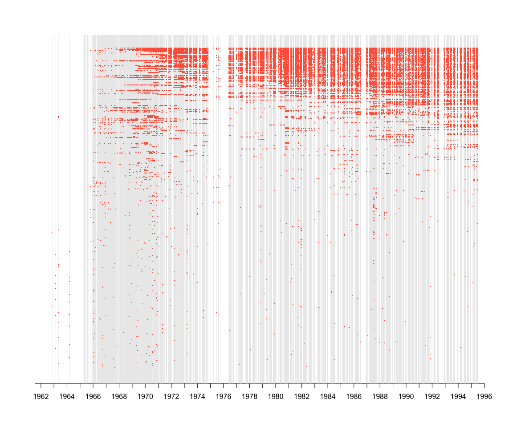

# ShowDB Analysis


```r
Sys.Date()
```

[1] "2014-06-16"


```r
library(lubridate)
library(xtable)
library(wesanderson)
```


```r
# setwd('~/Desktop/showdb/')
sdb <- read.delim('showdb.txt', sep='\t', head=TRUE)
```


```r
# head(sdb)
dim(sdb)
```

```
## [1] 5154   10
```

```r
str(sdb)
```

```
## 'data.frame':	5154 obs. of  10 variables:
##  $ ShowDate: Factor w/ 4637 levels "??/??/??","??/??/58",..: 1822 1835 1846 2297 2445 1664 1808 1819 1885 2031 ...
##  $ Venue   : Factor w/ 1583 levels "","\"The 8x10 Club\"",..: 1531 1531 1531 1532 1531 1531 1531 1531 1531 1531 ...
##  $ City    : Factor w/ 565 levels ""," Austin","?",..: 439 439 439 439 439 439 439 439 439 439 ...
##  $ State   : Factor w/ 85 levels "","AK","AL","Austria",..: 11 11 11 11 11 11 11 11 11 11 ...
##  $ Set1    : Factor w/ 4339 levels ""," Mike's Song-> I Am Hydrogen-> Weekapaug Groove, Harry Hood, Train Song, Billy Breathes, Frankenstein, Izabella",..: 1711 1615 604 1824 1812 1724 625 1927 1838 627 ...
##  $ Set2    : Factor w/ 3432 levels ""," Drowned -> Roses Are Free*-> Big Black Furry Creature From Mars-> Ghost-> Down With Disease (Reprise)-> Johnny B. Goode, E: Wa"| __truncated__,..: 2567 1 2897 2580 2941 2822 2918 1541 2821 2892 ...
##  $ Set3    : Factor w/ 151 levels "","* Acoustic mini-stage",..: 1 1 1 1 1 1 1 1 1 1 ...
##  $ Comment : Factor w/ 1970 levels ""," * Debut",..: 1040 1086 1062 1040 1040 1039 1039 1039 1039 1039 ...
##  $ Artist  : Factor w/ 3 levels "Grateful Dead",..: 2 2 2 2 2 2 2 2 2 2 ...
##  $ ShowID  : int  14827 14828 14829 14830 14831 14708 14709 14710 14711 14712 ...
```


```r
sdb$ShowDateOriginal <- sdb$ShowDate
sdb$ShowDate <- mdy(sdb$ShowDate)
```

```
## Warning: 73 failed to parse.
```

```r
reCent <- function(x){
  m <- year(x) %% 100
  year(x) <- ifelse(m > 60, 1900+m, 2000+m)
  x
}
sdb$ShowDate <- reCent(sdb$ShowDate)
```


```r
sdb <- sdb[which(!is.na(sdb$ShowDate)), ]
dim(sdb)
```

```
## [1] 5081   11
```


```r
nrow(sdb[which(sdb$City == '' | sdb$State == ''), c(1:4)])
```

```
## [1] 15
```


```r
names(sdb)
```

```
##  [1] "ShowDate"         "Venue"            "City"            
##  [4] "State"            "Set1"             "Set2"            
##  [7] "Set3"             "Comment"          "Artist"          
## [10] "ShowID"           "ShowDateOriginal"
```


```r
levels(sdb$Artist)
```

```
## [1] "Grateful Dead" "Jerry Garcia"  "Phish"
```

```r
gd <- sdb[sdb$Artist == 'Grateful Dead', ]
ph <- sdb[sdb$Artist == 'Phish', ]
jgb <- sdb[sdb$Artist == 'Jerry Garcia', ]
dim(gd); dim(ph); dim(jgb)
```

```
## [1] 1174   11
```


```r
gd <- gd[order(gd$ShowDate), ]
dates <- range(gd$ShowDate)
wholeRange <- seq(ymd(dates[1]), ymd(dates[2]),by='days')
```


```r
plot(wholeRange, 1:length(wholeRange), type='n', ann=FALSE, 
     yaxt='n', xaxt='n')
axis(1, at=seq(ymd('1961-1-1'), ymd('1996-1-1'), by='years'), seq(1961, 1996, 1))
abline(v=gd$ShowDate)
```

 


```r
delim <- "\\ \\-\\ E\\:\\ |E\\:\\ |E\\:|\\, |\\,|\\->\\ \\ |\\->\\ |\\->|\\ \\>\\ "

gd$Set1Clean <- gsub('\\*', '', gd$Set1)
gd$Set2Clean <- gsub('\\*', '', gd$Set2)
gd$Set3Clean <- gsub('\\*', '', gd$Set3)
gd$allCleanSets <- paste(gd$Set1Clean, gd$Set2Clean, gd$Set3Clean)
allSets <- c(gd$Set1Clean, gd$Set2Clean, gd$Set3Clean)
allSongs <- unlist(strsplit(as.character(allSets), delim))
allUniqueSongs <- sort(unique(allSongs))
length(allSongs)-1577  # minus blank entries
```

```
## [1] 39081
```

```r

## Unique Songs - used for debugging dataset
# cbind(allUniqueSongs)
```


```r
times <- matrix(0, nrow(gd), length(allUniqueSongs))
dimnames(times)[2] <- list(allUniqueSongs)
times[1:5, 1:5]
```

```
##        ? (I Can't Get No) Satisfaction <technical difficulties>?
## [1,] 0 0                             0                         0
## [2,] 0 0                             0                         0
## [3,] 0 0                             0                         0
## [4,] 0 0                             0                         0
## [5,] 0 0                             0                         0
##      A Little Light
## [1,]              0
## [2,]              0
## [3,]              0
## [4,]              0
## [5,]              0
```

```r
#cbind(dimnames(times)[[2]])
times <- times[, -c(1, 2, 4)]
times <- times[, -c(which(colnames(times) %in% 
                            c('', 
                              '?', 
                              '<technical difficulties>?',
                              'Rain')))]
times[1:5, 1:5]
```

```
##      (I Can't Get No) Satisfaction A Little Light A Love Supreme Jam
## [1,]                             0              0                  0
## [2,]                             0              0                  0
## [3,]                             0              0                  0
## [4,]                             0              0                  0
## [5,]                             0              0                  0
##      A Mexican Story: 25 Bennies A Mind To Give Up Livin'
## [1,]                           0                        0
## [2,]                           0                        0
## [3,]                           0                        0
## [4,]                           0                        0
## [5,]                           0                        0
```

```r

for (i in 1:ncol(times)) {
  song <- dimnames(times)[[2]][i]
  found <- grep(song, gd$allCleanSets)
  times[found, i] <- 1
  }
# rowSums(times) 
# sort(colSums(times))
times <- times[, order(colSums(times), decreasing=FALSE)]
counts <- data.frame(times=colSums(times), index=(ncol(times):1))
countsSort <- counts[order(counts$index), ]
# sum(counts$times)
```


```r
print(xtable(countsSort), type='html')
```

<!-- html table generated in R 3.0.2 by xtable 1.7-1 package -->
<!-- Mon Jun 16 11:31:54 2014 -->
<TABLE border=1>
<TR> <TH>  </TH> <TH> times </TH> <TH> index </TH>  </TR>
  <TR> <TD align="right"> Drums </TD> <TD align="right"> 1575.00 </TD> <TD align="right">   1 </TD> </TR>
  <TR> <TD align="right"> Me &amp  My Uncle </TD> <TD align="right"> 625.00 </TD> <TD align="right">   2 </TD> </TR>
  <TR> <TD align="right"> Playin' In The Band </TD> <TD align="right"> 611.00 </TD> <TD align="right">   3 </TD> </TR>
  <TR> <TD align="right"> The Other One </TD> <TD align="right"> 604.00 </TD> <TD align="right">   4 </TD> </TR>
  <TR> <TD align="right"> Sugar Magnolia </TD> <TD align="right"> 601.00 </TD> <TD align="right">   5 </TD> </TR>
  <TR> <TD align="right"> China Cat Sunflower </TD> <TD align="right"> 569.00 </TD> <TD align="right">   6 </TD> </TR>
  <TR> <TD align="right"> I Know You Rider </TD> <TD align="right"> 560.00 </TD> <TD align="right">   7 </TD> </TR>
  <TR> <TD align="right"> Not Fade Away </TD> <TD align="right"> 544.00 </TD> <TD align="right">   8 </TD> </TR>
  <TR> <TD align="right"> Truckin' </TD> <TD align="right"> 527.00 </TD> <TD align="right">   9 </TD> </TR>
  <TR> <TD align="right"> Space </TD> <TD align="right"> 511.00 </TD> <TD align="right">  10 </TD> </TR>
  <TR> <TD align="right"> Jack Straw </TD> <TD align="right"> 482.00 </TD> <TD align="right">  11 </TD> </TR>
  <TR> <TD align="right"> Tennessee Jed </TD> <TD align="right"> 439.00 </TD> <TD align="right">  12 </TD> </TR>
  <TR> <TD align="right"> Mexicali Blues </TD> <TD align="right"> 439.00 </TD> <TD align="right">  13 </TD> </TR>
  <TR> <TD align="right"> Minglewood Blues </TD> <TD align="right"> 438.00 </TD> <TD align="right">  14 </TD> </TR>
  <TR> <TD align="right"> Good Lovin' </TD> <TD align="right"> 436.00 </TD> <TD align="right">  15 </TD> </TR>
  <TR> <TD align="right"> The Promised Land </TD> <TD align="right"> 429.00 </TD> <TD align="right">  16 </TD> </TR>
  <TR> <TD align="right"> Deal </TD> <TD align="right"> 427.00 </TD> <TD align="right">  17 </TD> </TR>
  <TR> <TD align="right"> Around &amp  Around </TD> <TD align="right"> 422.00 </TD> <TD align="right">  18 </TD> </TR>
  <TR> <TD align="right"> El Paso </TD> <TD align="right"> 421.00 </TD> <TD align="right">  19 </TD> </TR>
  <TR> <TD align="right"> Looks Like Rain </TD> <TD align="right"> 417.00 </TD> <TD align="right">  20 </TD> </TR>
  <TR> <TD align="right"> Bertha </TD> <TD align="right"> 401.00 </TD> <TD align="right">  21 </TD> </TR>
  <TR> <TD align="right"> Wharf Rat </TD> <TD align="right"> 400.00 </TD> <TD align="right">  22 </TD> </TR>
  <TR> <TD align="right"> Big River </TD> <TD align="right"> 400.00 </TD> <TD align="right">  23 </TD> </TR>
  <TR> <TD align="right"> Estimated Prophet </TD> <TD align="right"> 393.00 </TD> <TD align="right">  24 </TD> </TR>
  <TR> <TD align="right"> Eyes Of The World </TD> <TD align="right"> 384.00 </TD> <TD align="right">  25 </TD> </TR>
  <TR> <TD align="right"> Jam </TD> <TD align="right"> 370.00 </TD> <TD align="right">  26 </TD> </TR>
  <TR> <TD align="right"> Samson &amp  Delilah </TD> <TD align="right"> 368.00 </TD> <TD align="right">  27 </TD> </TR>
  <TR> <TD align="right"> Sugaree </TD> <TD align="right"> 360.00 </TD> <TD align="right">  28 </TD> </TR>
  <TR> <TD align="right"> Turn On Your Lovelight </TD> <TD align="right"> 353.00 </TD> <TD align="right">  29 </TD> </TR>
  <TR> <TD align="right"> Brown Eyed Women </TD> <TD align="right"> 351.00 </TD> <TD align="right">  30 </TD> </TR>
  <TR> <TD align="right"> Loser </TD> <TD align="right"> 349.00 </TD> <TD align="right">  31 </TD> </TR>
  <TR> <TD align="right"> Black Peter </TD> <TD align="right"> 345.00 </TD> <TD align="right">  32 </TD> </TR>
  <TR> <TD align="right"> Uncle John's Band </TD> <TD align="right"> 343.00 </TD> <TD align="right">  33 </TD> </TR>
  <TR> <TD align="right"> One More Saturday Night </TD> <TD align="right"> 342.00 </TD> <TD align="right">  34 </TD> </TR>
  <TR> <TD align="right"> Cassidy </TD> <TD align="right"> 342.00 </TD> <TD align="right">  35 </TD> </TR>
  <TR> <TD align="right"> He's Gone </TD> <TD align="right"> 329.00 </TD> <TD align="right">  36 </TD> </TR>
  <TR> <TD align="right"> Stella Blue </TD> <TD align="right"> 328.00 </TD> <TD align="right">  37 </TD> </TR>
  <TR> <TD align="right"> Beat It On Down The Line </TD> <TD align="right"> 328.00 </TD> <TD align="right">  38 </TD> </TR>
  <TR> <TD align="right"> U.S. Blues </TD> <TD align="right"> 322.00 </TD> <TD align="right">  39 </TD> </TR>
  <TR> <TD align="right"> Casey Jones </TD> <TD align="right"> 322.00 </TD> <TD align="right">  40 </TD> </TR>
  <TR> <TD align="right"> Don't Ease Me In </TD> <TD align="right"> 320.00 </TD> <TD align="right">  41 </TD> </TR>
  <TR> <TD align="right"> Ramble On Rose </TD> <TD align="right"> 318.00 </TD> <TD align="right">  42 </TD> </TR>
  <TR> <TD align="right"> Scarlet Begonias </TD> <TD align="right"> 317.00 </TD> <TD align="right">  43 </TD> </TR>
  <TR> <TD align="right"> Friend Of The Devil </TD> <TD align="right"> 309.00 </TD> <TD align="right">  44 </TD> </TR>
  <TR> <TD align="right"> Bird Song </TD> <TD align="right"> 306.00 </TD> <TD align="right">  45 </TD> </TR>
  <TR> <TD align="right"> Terrapin Station </TD> <TD align="right"> 305.00 </TD> <TD align="right">  46 </TD> </TR>
  <TR> <TD align="right"> Mama Tried </TD> <TD align="right"> 305.00 </TD> <TD align="right">  47 </TD> </TR>
  <TR> <TD align="right"> Goin' Down The Road Feelin' Bad </TD> <TD align="right"> 297.00 </TD> <TD align="right">  48 </TD> </TR>
  <TR> <TD align="right"> New Minglewood Blues </TD> <TD align="right"> 289.00 </TD> <TD align="right">  49 </TD> </TR>
  <TR> <TD align="right"> It's All Over Now </TD> <TD align="right"> 288.00 </TD> <TD align="right">  50 </TD> </TR>
  <TR> <TD align="right"> Johnny B. Goode </TD> <TD align="right"> 285.00 </TD> <TD align="right">  51 </TD> </TR>
  <TR> <TD align="right"> The Greatest Story Ever Told </TD> <TD align="right"> 282.00 </TD> <TD align="right">  52 </TD> </TR>
  <TR> <TD align="right"> Candyman </TD> <TD align="right"> 282.00 </TD> <TD align="right">  53 </TD> </TR>
  <TR> <TD align="right"> Let It Grow </TD> <TD align="right"> 277.00 </TD> <TD align="right">  54 </TD> </TR>
  <TR> <TD align="right"> I Need A Miracle </TD> <TD align="right"> 275.00 </TD> <TD align="right">  55 </TD> </TR>
  <TR> <TD align="right"> Althea </TD> <TD align="right"> 275.00 </TD> <TD align="right">  56 </TD> </TR>
  <TR> <TD align="right"> Row Jimmy </TD> <TD align="right"> 274.00 </TD> <TD align="right">  57 </TD> </TR>
  <TR> <TD align="right"> Little Red Rooster </TD> <TD align="right"> 272.00 </TD> <TD align="right">  58 </TD> </TR>
  <TR> <TD align="right"> Throwing Stones </TD> <TD align="right"> 269.00 </TD> <TD align="right">  59 </TD> </TR>
  <TR> <TD align="right"> Morning Dew </TD> <TD align="right"> 262.00 </TD> <TD align="right">  60 </TD> </TR>
  <TR> <TD align="right"> The Wheel </TD> <TD align="right"> 259.00 </TD> <TD align="right">  61 </TD> </TR>
  <TR> <TD align="right"> Fire On The Mountain </TD> <TD align="right"> 258.00 </TD> <TD align="right">  62 </TD> </TR>
  <TR> <TD align="right"> Rain And Snow </TD> <TD align="right"> 254.00 </TD> <TD align="right">  63 </TD> </TR>
  <TR> <TD align="right"> Dark Star </TD> <TD align="right"> 240.00 </TD> <TD align="right">  64 </TD> </TR>
  <TR> <TD align="right"> The Music Never Stopped </TD> <TD align="right"> 239.00 </TD> <TD align="right">  65 </TD> </TR>
  <TR> <TD align="right"> Peggy-O </TD> <TD align="right"> 238.00 </TD> <TD align="right">  66 </TD> </TR>
  <TR> <TD align="right"> Mississippi Half-Step UpTown Toodleloo </TD> <TD align="right"> 236.00 </TD> <TD align="right">  67 </TD> </TR>
  <TR> <TD align="right"> Dire Wolf </TD> <TD align="right"> 232.00 </TD> <TD align="right">  68 </TD> </TR>
  <TR> <TD align="right"> They Love Each Other </TD> <TD align="right"> 230.00 </TD> <TD align="right">  69 </TD> </TR>
  <TR> <TD align="right"> Cumberland Blues </TD> <TD align="right"> 230.00 </TD> <TD align="right">  70 </TD> </TR>
  <TR> <TD align="right"> Ship Of Fools </TD> <TD align="right"> 226.00 </TD> <TD align="right">  71 </TD> </TR>
  <TR> <TD align="right"> Saint Of Circumstance </TD> <TD align="right"> 226.00 </TD> <TD align="right">  72 </TD> </TR>
  <TR> <TD align="right"> Franklin's Tower </TD> <TD align="right"> 222.00 </TD> <TD align="right">  73 </TD> </TR>
  <TR> <TD align="right"> Brokedown Palace </TD> <TD align="right"> 220.00 </TD> <TD align="right">  74 </TD> </TR>
  <TR> <TD align="right"> Hell In A Bucket </TD> <TD align="right"> 219.00 </TD> <TD align="right">  75 </TD> </TR>
  <TR> <TD align="right"> Touch Of Grey </TD> <TD align="right"> 214.00 </TD> <TD align="right">  76 </TD> </TR>
  <TR> <TD align="right"> Feel Like A Stranger </TD> <TD align="right"> 209.00 </TD> <TD align="right">  77 </TD> </TR>
  <TR> <TD align="right"> Men Smart Women Smarter </TD> <TD align="right"> 199.00 </TD> <TD align="right">  78 </TD> </TR>
  <TR> <TD align="right"> Iko Iko </TD> <TD align="right"> 185.00 </TD> <TD align="right">  79 </TD> </TR>
  <TR> <TD align="right"> Saint Stephen </TD> <TD align="right"> 181.00 </TD> <TD align="right">  80 </TD> </TR>
  <TR> <TD align="right"> Big Railroad Blues </TD> <TD align="right"> 177.00 </TD> <TD align="right">  81 </TD> </TR>
  <TR> <TD align="right"> Shakedown Street </TD> <TD align="right"> 166.00 </TD> <TD align="right">  82 </TD> </TR>
  <TR> <TD align="right"> Box Of Rain </TD> <TD align="right"> 162.00 </TD> <TD align="right">  83 </TD> </TR>
  <TR> <TD align="right"> It Must Have Been The Roses </TD> <TD align="right"> 159.00 </TD> <TD align="right">  84 </TD> </TR>
  <TR> <TD align="right"> Black Throated Wind </TD> <TD align="right"> 159.00 </TD> <TD align="right">  85 </TD> </TR>
  <TR> <TD align="right"> Crazy Fingers </TD> <TD align="right"> 150.00 </TD> <TD align="right">  86 </TD> </TR>
  <TR> <TD align="right"> When I Paint My Masterpiece </TD> <TD align="right"> 149.00 </TD> <TD align="right">  87 </TD> </TR>
  <TR> <TD align="right"> Stagger Lee </TD> <TD align="right"> 148.00 </TD> <TD align="right">  88 </TD> </TR>
  <TR> <TD align="right"> Lost Sailor </TD> <TD align="right"> 148.00 </TD> <TD align="right">  89 </TD> </TR>
  <TR> <TD align="right"> Baby Blue </TD> <TD align="right"> 146.00 </TD> <TD align="right">  90 </TD> </TR>
  <TR> <TD align="right"> West L.A. Fadeaway </TD> <TD align="right"> 144.00 </TD> <TD align="right">  91 </TD> </TR>
  <TR> <TD align="right"> Cryptical Envelopment </TD> <TD align="right"> 144.00 </TD> <TD align="right">  92 </TD> </TR>
  <TR> <TD align="right"> Alabama Getaway </TD> <TD align="right"> 143.00 </TD> <TD align="right">  93 </TD> </TR>
  <TR> <TD align="right"> Walkin' Blues </TD> <TD align="right"> 138.00 </TD> <TD align="right">  94 </TD> </TR>
  <TR> <TD align="right"> High Time </TD> <TD align="right"> 135.00 </TD> <TD align="right">  95 </TD> </TR>
  <TR> <TD align="right"> Dancin' In The Streets </TD> <TD align="right"> 131.00 </TD> <TD align="right">  96 </TD> </TR>
  <TR> <TD align="right"> Supplication </TD> <TD align="right"> 129.00 </TD> <TD align="right">  97 </TD> </TR>
  <TR> <TD align="right"> Queen Jane Approximately </TD> <TD align="right"> 129.00 </TD> <TD align="right">  98 </TD> </TR>
  <TR> <TD align="right"> C.C. Rider </TD> <TD align="right"> 128.00 </TD> <TD align="right">  99 </TD> </TR>
  <TR> <TD align="right"> All Along The Watchtower </TD> <TD align="right"> 123.00 </TD> <TD align="right"> 100 </TD> </TR>
  <TR> <TD align="right"> Me And Bobby McGee </TD> <TD align="right"> 121.00 </TD> <TD align="right"> 101 </TD> </TR>
  <TR> <TD align="right"> Jack A Roe </TD> <TD align="right"> 118.00 </TD> <TD align="right"> 102 </TD> </TR>
  <TR> <TD align="right"> Lazy Lightnin' </TD> <TD align="right"> 116.00 </TD> <TD align="right"> 103 </TD> </TR>
  <TR> <TD align="right"> Might As Well </TD> <TD align="right"> 114.00 </TD> <TD align="right"> 104 </TD> </TR>
  <TR> <TD align="right"> China Doll </TD> <TD align="right"> 114.00 </TD> <TD align="right"> 105 </TD> </TR>
  <TR> <TD align="right"> Slipknot! </TD> <TD align="right"> 113.00 </TD> <TD align="right"> 106 </TD> </TR>
  <TR> <TD align="right"> Help On The Way </TD> <TD align="right"> 111.00 </TD> <TD align="right"> 107 </TD> </TR>
  <TR> <TD align="right"> Hard To Handle </TD> <TD align="right"> 108.00 </TD> <TD align="right"> 108 </TD> </TR>
  <TR> <TD align="right"> My Brother Esau </TD> <TD align="right"> 107.00 </TD> <TD align="right"> 109 </TD> </TR>
  <TR> <TD align="right"> The Eleven </TD> <TD align="right"> 104.00 </TD> <TD align="right"> 110 </TD> </TR>
  <TR> <TD align="right"> Victim Or The Crime </TD> <TD align="right"> 101.00 </TD> <TD align="right"> 111 </TD> </TR>
  <TR> <TD align="right"> Passenger </TD> <TD align="right"> 99.00 </TD> <TD align="right"> 112 </TD> </TR>
  <TR> <TD align="right"> Loose Lucy </TD> <TD align="right"> 98.00 </TD> <TD align="right"> 113 </TD> </TR>
  <TR> <TD align="right"> Way To Go Home </TD> <TD align="right"> 92.00 </TD> <TD align="right"> 114 </TD> </TR>
  <TR> <TD align="right"> Wang Dang Doodle </TD> <TD align="right"> 91.00 </TD> <TD align="right"> 115 </TD> </TR>
  <TR> <TD align="right"> Gimme Some Lovin' </TD> <TD align="right"> 88.00 </TD> <TD align="right"> 116 </TD> </TR>
  <TR> <TD align="right"> Foolish Heart </TD> <TD align="right"> 87.00 </TD> <TD align="right"> 117 </TD> </TR>
  <TR> <TD align="right"> Dupree's Diamond Blues </TD> <TD align="right"> 84.00 </TD> <TD align="right"> 118 </TD> </TR>
  <TR> <TD align="right"> Memphis Blues </TD> <TD align="right"> 78.00 </TD> <TD align="right"> 119 </TD> </TR>
  <TR> <TD align="right"> Knockin' On Heaven's Door </TD> <TD align="right"> 78.00 </TD> <TD align="right"> 120 </TD> </TR>
  <TR> <TD align="right"> Corinna </TD> <TD align="right"> 78.00 </TD> <TD align="right"> 121 </TD> </TR>
  <TR> <TD align="right"> Standing On The Moon </TD> <TD align="right"> 77.00 </TD> <TD align="right"> 122 </TD> </TR>
  <TR> <TD align="right"> Picasso Moon </TD> <TD align="right"> 77.00 </TD> <TD align="right"> 123 </TD> </TR>
  <TR> <TD align="right"> Far From Me </TD> <TD align="right"> 76.00 </TD> <TD align="right"> 124 </TD> </TR>
  <TR> <TD align="right"> Big Boss Man </TD> <TD align="right"> 76.00 </TD> <TD align="right"> 125 </TD> </TR>
  <TR> <TD align="right"> Next Time You See Me </TD> <TD align="right"> 75.00 </TD> <TD align="right"> 126 </TD> </TR>
  <TR> <TD align="right"> Good Morning Little School Girl </TD> <TD align="right"> 73.00 </TD> <TD align="right"> 127 </TD> </TR>
  <TR> <TD align="right"> Caution </TD> <TD align="right"> 71.00 </TD> <TD align="right"> 128 </TD> </TR>
  <TR> <TD align="right"> The Last Time </TD> <TD align="right"> 70.00 </TD> <TD align="right"> 129 </TD> </TR>
  <TR> <TD align="right"> Comes A Time </TD> <TD align="right"> 70.00 </TD> <TD align="right"> 130 </TD> </TR>
  <TR> <TD align="right"> Lazy River Road </TD> <TD align="right"> 67.00 </TD> <TD align="right"> 131 </TD> </TR>
  <TR> <TD align="right"> Alligator </TD> <TD align="right"> 67.00 </TD> <TD align="right"> 132 </TD> </TR>
  <TR> <TD align="right"> Here Comes Sunshine </TD> <TD align="right"> 66.00 </TD> <TD align="right"> 133 </TD> </TR>
  <TR> <TD align="right"> Black Muddy River </TD> <TD align="right"> 66.00 </TD> <TD align="right"> 134 </TD> </TR>
  <TR> <TD align="right"> To Lay Me Down </TD> <TD align="right"> 64.00 </TD> <TD align="right"> 135 </TD> </TR>
  <TR> <TD align="right"> Smokestack Lightning </TD> <TD align="right"> 63.00 </TD> <TD align="right"> 136 </TD> </TR>
  <TR> <TD align="right"> The Race Is On </TD> <TD align="right"> 61.00 </TD> <TD align="right"> 137 </TD> </TR>
  <TR> <TD align="right"> We Bid You Good Night </TD> <TD align="right"> 60.00 </TD> <TD align="right"> 138 </TD> </TR>
  <TR> <TD align="right"> The Mighty Quinn </TD> <TD align="right"> 60.00 </TD> <TD align="right"> 139 </TD> </TR>
  <TR> <TD align="right"> Keep Your Day Job </TD> <TD align="right"> 60.00 </TD> <TD align="right"> 140 </TD> </TR>
  <TR> <TD align="right"> When Push Comes To Shove </TD> <TD align="right"> 58.00 </TD> <TD align="right"> 141 </TD> </TR>
  <TR> <TD align="right"> Just Like Tom Thumb's Blues </TD> <TD align="right"> 58.00 </TD> <TD align="right"> 142 </TD> </TR>
  <TR> <TD align="right"> Desolation Row </TD> <TD align="right"> 58.00 </TD> <TD align="right"> 143 </TD> </TR>
  <TR> <TD align="right"> Dear Mr. Fantasy </TD> <TD align="right"> 58.00 </TD> <TD align="right"> 144 </TD> </TR>
  <TR> <TD align="right"> New Speedway Boogie </TD> <TD align="right"> 57.00 </TD> <TD align="right"> 145 </TD> </TR>
  <TR> <TD align="right"> Deep Elem </TD> <TD align="right"> 57.00 </TD> <TD align="right"> 146 </TD> </TR>
  <TR> <TD align="right"> Liberty </TD> <TD align="right"> 56.00 </TD> <TD align="right"> 147 </TD> </TR>
  <TR> <TD align="right"> Deep Elem Blues </TD> <TD align="right"> 56.00 </TD> <TD align="right"> 148 </TD> </TR>
  <TR> <TD align="right"> So Many Roads </TD> <TD align="right"> 55.00 </TD> <TD align="right"> 149 </TD> </TR>
  <TR> <TD align="right"> Spoonful </TD> <TD align="right"> 54.00 </TD> <TD align="right"> 150 </TD> </TR>
  <TR> <TD align="right"> Spanish Jam </TD> <TD align="right"> 54.00 </TD> <TD align="right"> 151 </TD> </TR>
  <TR> <TD align="right"> Hurts Me Too </TD> <TD align="right"> 54.00 </TD> <TD align="right"> 152 </TD> </TR>
  <TR> <TD align="right"> Death Don't Have No Mercy </TD> <TD align="right"> 54.00 </TD> <TD align="right"> 153 </TD> </TR>
  <TR> <TD align="right"> Attics Of My Life </TD> <TD align="right"> 54.00 </TD> <TD align="right"> 154 </TD> </TR>
  <TR> <TD align="right"> Weather Report Suite Prelude </TD> <TD align="right"> 53.00 </TD> <TD align="right"> 155 </TD> </TR>
  <TR> <TD align="right"> It Hurts Me Too </TD> <TD align="right"> 53.00 </TD> <TD align="right"> 156 </TD> </TR>
  <TR> <TD align="right"> Feedback </TD> <TD align="right"> 52.00 </TD> <TD align="right"> 157 </TD> </TR>
  <TR> <TD align="right"> Mr. Charlie </TD> <TD align="right"> 49.00 </TD> <TD align="right"> 158 </TD> </TR>
  <TR> <TD align="right"> Let The Good Times Roll </TD> <TD align="right"> 49.00 </TD> <TD align="right"> 159 </TD> </TR>
  <TR> <TD align="right"> In The Midnight Hour </TD> <TD align="right"> 48.00 </TD> <TD align="right"> 160 </TD> </TR>
  <TR> <TD align="right"> Easy Wind </TD> <TD align="right"> 48.00 </TD> <TD align="right"> 161 </TD> </TR>
  <TR> <TD align="right"> Weather Report Suite Part 1 </TD> <TD align="right"> 47.00 </TD> <TD align="right"> 162 </TD> </TR>
  <TR> <TD align="right"> Easy To Love You </TD> <TD align="right"> 47.00 </TD> <TD align="right"> 163 </TD> </TR>
  <TR> <TD align="right"> Cosmic Charlie </TD> <TD align="right"> 47.00 </TD> <TD align="right"> 164 </TD> </TR>
  <TR> <TD align="right"> Top Of The World </TD> <TD align="right"> 46.00 </TD> <TD align="right"> 165 </TD> </TR>
  <TR> <TD align="right"> The Same Thing </TD> <TD align="right"> 46.00 </TD> <TD align="right"> 166 </TD> </TR>
  <TR> <TD align="right"> Easy Answers </TD> <TD align="right"> 45.00 </TD> <TD align="right"> 167 </TD> </TR>
  <TR> <TD align="right"> Ripple </TD> <TD align="right"> 44.00 </TD> <TD align="right"> 168 </TD> </TR>
  <TR> <TD align="right"> Maggie's Farm </TD> <TD align="right"> 44.00 </TD> <TD align="right"> 169 </TD> </TR>
  <TR> <TD align="right"> Eternity </TD> <TD align="right"> 44.00 </TD> <TD align="right"> 170 </TD> </TR>
  <TR> <TD align="right"> Sittin' On Top Of The World </TD> <TD align="right"> 43.00 </TD> <TD align="right"> 171 </TD> </TR>
  <TR> <TD align="right"> Doin' That Rag </TD> <TD align="right"> 43.00 </TD> <TD align="right"> 172 </TD> </TR>
  <TR> <TD align="right"> On The Road Again </TD> <TD align="right"> 42.00 </TD> <TD align="right"> 173 </TD> </TR>
  <TR> <TD align="right"> King Bee </TD> <TD align="right"> 42.00 </TD> <TD align="right"> 174 </TD> </TR>
  <TR> <TD align="right"> The Weight </TD> <TD align="right"> 41.00 </TD> <TD align="right"> 175 </TD> </TR>
  <TR> <TD align="right"> The Days Between </TD> <TD align="right"> 41.00 </TD> <TD align="right"> 176 </TD> </TR>
  <TR> <TD align="right"> Sing Me Back Home </TD> <TD align="right"> 40.00 </TD> <TD align="right"> 177 </TD> </TR>
  <TR> <TD align="right"> Good Time Blues </TD> <TD align="right"> 40.00 </TD> <TD align="right"> 178 </TD> </TR>
  <TR> <TD align="right"> Monkey &amp  The Engineer </TD> <TD align="right"> 39.00 </TD> <TD align="right"> 179 </TD> </TR>
  <TR> <TD align="right"> Viola Lee Blues </TD> <TD align="right"> 38.00 </TD> <TD align="right"> 180 </TD> </TR>
  <TR> <TD align="right"> Samba In The Rain </TD> <TD align="right"> 38.00 </TD> <TD align="right"> 181 </TD> </TR>
  <TR> <TD align="right"> Nobody's Fault But Mine </TD> <TD align="right"> 37.00 </TD> <TD align="right"> 182 </TD> </TR>
  <TR> <TD align="right"> I'm A King Bee </TD> <TD align="right"> 37.00 </TD> <TD align="right"> 183 </TD> </TR>
  <TR> <TD align="right"> I Fought The Law </TD> <TD align="right"> 36.00 </TD> <TD align="right"> 184 </TD> </TR>
  <TR> <TD align="right"> Broken Arrow </TD> <TD align="right"> 35.00 </TD> <TD align="right"> 185 </TD> </TR>
  <TR> <TD align="right"> I Will Take You Home </TD> <TD align="right"> 34.00 </TD> <TD align="right"> 186 </TD> </TR>
  <TR> <TD align="right"> Dark Hollow </TD> <TD align="right"> 34.00 </TD> <TD align="right"> 187 </TD> </TR>
  <TR> <TD align="right"> Sunshine Daydream </TD> <TD align="right"> 32.00 </TD> <TD align="right"> 188 </TD> </TR>
  <TR> <TD align="right"> Tons Of Steel </TD> <TD align="right"> 31.00 </TD> <TD align="right"> 189 </TD> </TR>
  <TR> <TD align="right"> Sunrise </TD> <TD align="right"> 31.00 </TD> <TD align="right"> 190 </TD> </TR>
  <TR> <TD align="right"> Hey Jude </TD> <TD align="right"> 31.00 </TD> <TD align="right"> 191 </TD> </TR>
  <TR> <TD align="right"> New Potato Caboose </TD> <TD align="right"> 29.00 </TD> <TD align="right"> 192 </TD> </TR>
  <TR> <TD align="right"> Hey Jude Finale </TD> <TD align="right"> 28.00 </TD> <TD align="right"> 193 </TD> </TR>
  <TR> <TD align="right"> Chinatown Shuffle </TD> <TD align="right"> 28.00 </TD> <TD align="right"> 194 </TD> </TR>
  <TR> <TD align="right"> From The Heart Of Me </TD> <TD align="right"> 27.00 </TD> <TD align="right"> 195 </TD> </TR>
  <TR> <TD align="right"> You Win Again </TD> <TD align="right"> 26.00 </TD> <TD align="right"> 196 </TD> </TR>
  <TR> <TD align="right"> Hey Pocky Way </TD> <TD align="right"> 25.00 </TD> <TD align="right"> 197 </TD> </TR>
  <TR> <TD align="right"> Wave To The Wind </TD> <TD align="right"> 23.00 </TD> <TD align="right"> 198 </TD> </TR>
  <TR> <TD align="right"> Blow Away </TD> <TD align="right"> 23.00 </TD> <TD align="right"> 199 </TD> </TR>
  <TR> <TD align="right"> We Can Run But We Can't Hide </TD> <TD align="right"> 22.00 </TD> <TD align="right"> 200 </TD> </TR>
  <TR> <TD align="right"> Phil &amp  Ned </TD> <TD align="right"> 22.00 </TD> <TD align="right"> 201 </TD> </TR>
  <TR> <TD align="right"> All Around This World </TD> <TD align="right"> 21.00 </TD> <TD align="right"> 202 </TD> </TR>
  <TR> <TD align="right"> A Little Light </TD> <TD align="right"> 21.00 </TD> <TD align="right"> 203 </TD> </TR>
  <TR> <TD align="right"> I've Been All Around This World </TD> <TD align="right"> 20.00 </TD> <TD align="right"> 204 </TD> </TR>
  <TR> <TD align="right"> He Was A Friend Of Mine </TD> <TD align="right"> 20.00 </TD> <TD align="right"> 205 </TD> </TR>
  <TR> <TD align="right"> Mason's Children </TD> <TD align="right"> 19.00 </TD> <TD align="right"> 206 </TD> </TR>
  <TR> <TD align="right"> Lucy In The Sky With Diamonds </TD> <TD align="right"> 19.00 </TD> <TD align="right"> 207 </TD> </TR>
  <TR> <TD align="right"> Silver Threads And Golden Needles </TD> <TD align="right"> 18.00 </TD> <TD align="right"> 208 </TD> </TR>
  <TR> <TD align="right"> Mind Left Body Jam </TD> <TD align="right"> 18.00 </TD> <TD align="right"> 209 </TD> </TR>
  <TR> <TD align="right"> Built To Last </TD> <TD align="right"> 18.00 </TD> <TD align="right"> 210 </TD> </TR>
  <TR> <TD align="right"> That Would Be Something </TD> <TD align="right"> 17.00 </TD> <TD align="right"> 211 </TD> </TR>
  <TR> <TD align="right"> Rosalie McFall </TD> <TD align="right"> 17.00 </TD> <TD align="right"> 212 </TD> </TR>
  <TR> <TD align="right"> Mountains Of The Moon </TD> <TD align="right"> 17.00 </TD> <TD align="right"> 213 </TD> </TR>
  <TR> <TD align="right"> If The Shoe Fits </TD> <TD align="right"> 17.00 </TD> <TD align="right"> 214 </TD> </TR>
  <TR> <TD align="right"> Heaven Help The Fool </TD> <TD align="right"> 17.00 </TD> <TD align="right"> 215 </TD> </TR>
  <TR> <TD align="right"> Gloria </TD> <TD align="right"> 17.00 </TD> <TD align="right"> 216 </TD> </TR>
  <TR> <TD align="right"> Funiculi Funicula </TD> <TD align="right"> 17.00 </TD> <TD align="right"> 217 </TD> </TR>
  <TR> <TD align="right"> Ain't No Lie </TD> <TD align="right"> 17.00 </TD> <TD align="right"> 218 </TD> </TR>
  <TR> <TD align="right"> Don't Need Love </TD> <TD align="right"> 16.00 </TD> <TD align="right"> 219 </TD> </TR>
  <TR> <TD align="right"> Born Cross-Eyed </TD> <TD align="right"> 16.00 </TD> <TD align="right"> 220 </TD> </TR>
  <TR> <TD align="right"> You Ain't Woman Enough </TD> <TD align="right"> 15.00 </TD> <TD align="right"> 221 </TD> </TR>
  <TR> <TD align="right"> Wave That Flag </TD> <TD align="right"> 15.00 </TD> <TD align="right"> 222 </TD> </TR>
  <TR> <TD align="right"> Wake Up Little Susie </TD> <TD align="right"> 15.00 </TD> <TD align="right"> 223 </TD> </TR>
  <TR> <TD align="right"> It's A Sin </TD> <TD align="right"> 15.00 </TD> <TD align="right"> 224 </TD> </TR>
  <TR> <TD align="right"> Cold Jordan </TD> <TD align="right"> 15.00 </TD> <TD align="right"> 225 </TD> </TR>
  <TR> <TD align="right"> The Rub </TD> <TD align="right"> 14.00 </TD> <TD align="right"> 226 </TD> </TR>
  <TR> <TD align="right"> Dark Star Jam </TD> <TD align="right"> 14.00 </TD> <TD align="right"> 227 </TD> </TR>
  <TR> <TD align="right"> Supplication Jam </TD> <TD align="right"> 13.00 </TD> <TD align="right"> 228 </TD> </TR>
  <TR> <TD align="right"> Revolution </TD> <TD align="right"> 13.00 </TD> <TD align="right"> 229 </TD> </TR>
  <TR> <TD align="right"> Nobody's Fault But Mine Jam </TD> <TD align="right"> 13.00 </TD> <TD align="right"> 230 </TD> </TR>
  <TR> <TD align="right"> Beer Barrel Polka </TD> <TD align="right"> 13.00 </TD> <TD align="right"> 231 </TD> </TR>
  <TR> <TD align="right"> Werewolves Of London </TD> <TD align="right"> 12.00 </TD> <TD align="right"> 232 </TD> </TR>
  <TR> <TD align="right"> Two Souls In Communion </TD> <TD align="right"> 12.00 </TD> <TD align="right"> 233 </TD> </TR>
  <TR> <TD align="right"> Tomorrow Never Knows </TD> <TD align="right"> 12.00 </TD> <TD align="right"> 234 </TD> </TR>
  <TR> <TD align="right"> Playin' In The Band Reprise </TD> <TD align="right"> 12.00 </TD> <TD align="right"> 235 </TD> </TR>
  <TR> <TD align="right"> Ollin Arrageed </TD> <TD align="right"> 12.00 </TD> <TD align="right"> 236 </TD> </TR>
  <TR> <TD align="right"> Katie Mae </TD> <TD align="right"> 12.00 </TD> <TD align="right"> 237 </TD> </TR>
  <TR> <TD align="right"> Childhood's End </TD> <TD align="right"> 12.00 </TD> <TD align="right"> 238 </TD> </TR>
  <TR> <TD align="right"> Baba O'Riley </TD> <TD align="right"> 12.00 </TD> <TD align="right"> 239 </TD> </TR>
  <TR> <TD align="right"> Swing Low </TD> <TD align="right"> 11.00 </TD> <TD align="right"> 240 </TD> </TR>
  <TR> <TD align="right"> She Belongs To Me </TD> <TD align="right"> 11.00 </TD> <TD align="right"> 241 </TD> </TR>
  <TR> <TD align="right"> It's A Man's World </TD> <TD align="right"> 11.00 </TD> <TD align="right"> 242 </TD> </TR>
  <TR> <TD align="right"> Unbroken Chain </TD> <TD align="right"> 10.00 </TD> <TD align="right"> 243 </TD> </TR>
  <TR> <TD align="right"> Tomorrow Is Forever </TD> <TD align="right"> 10.00 </TD> <TD align="right"> 244 </TD> </TR>
  <TR> <TD align="right"> Cream Puff War </TD> <TD align="right"> 10.00 </TD> <TD align="right"> 245 </TD> </TR>
  <TR> <TD align="right"> Slewfoot </TD> <TD align="right"> 9.00 </TD> <TD align="right"> 246 </TD> </TR>
  <TR> <TD align="right"> Louie Louie </TD> <TD align="right"> 9.00 </TD> <TD align="right"> 247 </TD> </TR>
  <TR> <TD align="right"> Instrumental </TD> <TD align="right"> 9.00 </TD> <TD align="right"> 248 </TD> </TR>
  <TR> <TD align="right"> Green Green Grass Of Home </TD> <TD align="right"> 9.00 </TD> <TD align="right"> 249 </TD> </TR>
  <TR> <TD align="right"> Down In The Bottom </TD> <TD align="right"> 9.00 </TD> <TD align="right"> 250 </TD> </TR>
  <TR> <TD align="right"> Clementine </TD> <TD align="right"> 9.00 </TD> <TD align="right"> 251 </TD> </TR>
  <TR> <TD align="right"> Ballad Of A Thin Man </TD> <TD align="right"> 9.00 </TD> <TD align="right"> 252 </TD> </TR>
  <TR> <TD align="right"> Visions Of Johanna </TD> <TD align="right"> 8.00 </TD> <TD align="right"> 253 </TD> </TR>
  <TR> <TD align="right"> Tuning </TD> <TD align="right"> 8.00 </TD> <TD align="right"> 254 </TD> </TR>
  <TR> <TD align="right"> Stronger Than Dirt </TD> <TD align="right"> 8.00 </TD> <TD align="right"> 255 </TD> </TR>
  <TR> <TD align="right"> Second That Emotion </TD> <TD align="right"> 8.00 </TD> <TD align="right"> 256 </TD> </TR>
  <TR> <TD align="right"> Me &amp  My Uncle  </TD> <TD align="right"> 8.00 </TD> <TD align="right"> 257 </TD> </TR>
  <TR> <TD align="right"> I Want To Tell You </TD> <TD align="right"> 8.00 </TD> <TD align="right"> 258 </TD> </TR>
  <TR> <TD align="right"> I Ain't Superstitous </TD> <TD align="right"> 8.00 </TD> <TD align="right"> 259 </TD> </TR>
  <TR> <TD align="right"> Blues For Allah </TD> <TD align="right"> 8.00 </TD> <TD align="right"> 260 </TD> </TR>
  <TR> <TD align="right"> Big Boy Pete </TD> <TD align="right"> 8.00 </TD> <TD align="right"> 261 </TD> </TR>
  <TR> <TD align="right"> Why Don't We Do It In The Road </TD> <TD align="right"> 7.00 </TD> <TD align="right"> 262 </TD> </TR>
  <TR> <TD align="right"> The Eleven Jam </TD> <TD align="right"> 7.00 </TD> <TD align="right"> 263 </TD> </TR>
  <TR> <TD align="right"> Stealin' </TD> <TD align="right"> 7.00 </TD> <TD align="right"> 264 </TD> </TR>
  <TR> <TD align="right"> Run Rudolph Run </TD> <TD align="right"> 7.00 </TD> <TD align="right"> 265 </TD> </TR>
  <TR> <TD align="right"> Rap </TD> <TD align="right"> 7.00 </TD> <TD align="right"> 266 </TD> </TR>
  <TR> <TD align="right"> Oh Boy </TD> <TD align="right"> 7.00 </TD> <TD align="right"> 267 </TD> </TR>
  <TR> <TD align="right"> Little Sadie </TD> <TD align="right"> 7.00 </TD> <TD align="right"> 268 </TD> </TR>
  <TR> <TD align="right"> It Takes A Lot To Laugh It Takes A Train To Cry </TD> <TD align="right"> 7.00 </TD> <TD align="right"> 269 </TD> </TR>
  <TR> <TD align="right"> Hi-Heel Sneakers </TD> <TD align="right"> 7.00 </TD> <TD align="right"> 270 </TD> </TR>
  <TR> <TD align="right"> Hand Jive </TD> <TD align="right"> 7.00 </TD> <TD align="right"> 271 </TD> </TR>
  <TR> <TD align="right"> Frozen Logger </TD> <TD align="right"> 7.00 </TD> <TD align="right"> 272 </TD> </TR>
  <TR> <TD align="right"> China Cat Sunflower Jam </TD> <TD align="right"> 7.00 </TD> <TD align="right"> 273 </TD> </TR>
  <TR> <TD align="right"> Black Limousine </TD> <TD align="right"> 7.00 </TD> <TD align="right"> 274 </TD> </TR>
  <TR> <TD align="right"> Believe It Or Not </TD> <TD align="right"> 7.00 </TD> <TD align="right"> 275 </TD> </TR>
  <TR> <TD align="right"> You Don't Have To Ask </TD> <TD align="right"> 6.00 </TD> <TD align="right"> 276 </TD> </TR>
  <TR> <TD align="right"> Walkin' The Dog </TD> <TD align="right"> 6.00 </TD> <TD align="right"> 277 </TD> </TR>
  <TR> <TD align="right"> Valley Road </TD> <TD align="right"> 6.00 </TD> <TD align="right"> 278 </TD> </TR>
  <TR> <TD align="right"> Till The Morning Comes </TD> <TD align="right"> 6.00 </TD> <TD align="right"> 279 </TD> </TR>
  <TR> <TD align="right"> The Other One Jam </TD> <TD align="right"> 6.00 </TD> <TD align="right"> 280 </TD> </TR>
  <TR> <TD align="right"> The Main Ten </TD> <TD align="right"> 6.00 </TD> <TD align="right"> 281 </TD> </TR>
  <TR> <TD align="right"> The Frozen Logger </TD> <TD align="right"> 6.00 </TD> <TD align="right"> 282 </TD> </TR>
  <TR> <TD align="right"> Seasons Of My Heart </TD> <TD align="right"> 6.00 </TD> <TD align="right"> 283 </TD> </TR>
  <TR> <TD align="right"> Maybe You Know </TD> <TD align="right"> 6.00 </TD> <TD align="right"> 284 </TD> </TR>
  <TR> <TD align="right"> Mathilda </TD> <TD align="right"> 6.00 </TD> <TD align="right"> 285 </TD> </TR>
  <TR> <TD align="right"> Long Black Limousine </TD> <TD align="right"> 6.00 </TD> <TD align="right"> 286 </TD> </TR>
  <TR> <TD align="right"> Let Me Sing </TD> <TD align="right"> 6.00 </TD> <TD align="right"> 287 </TD> </TR>
  <TR> <TD align="right"> It's All Too Much </TD> <TD align="right"> 6.00 </TD> <TD align="right"> 288 </TD> </TR>
  <TR> <TD align="right"> Hog For You Baby </TD> <TD align="right"> 6.00 </TD> <TD align="right"> 289 </TD> </TR>
  <TR> <TD align="right"> Hey Bo Diddley </TD> <TD align="right"> 6.00 </TD> <TD align="right"> 290 </TD> </TR>
  <TR> <TD align="right"> Baby What You Want Me To Do </TD> <TD align="right"> 6.00 </TD> <TD align="right"> 291 </TD> </TR>
  <TR> <TD align="right"> Uncle John's Band Jam </TD> <TD align="right"> 5.00 </TD> <TD align="right"> 292 </TD> </TR>
  <TR> <TD align="right"> The Seven </TD> <TD align="right"> 5.00 </TD> <TD align="right"> 293 </TD> </TR>
  <TR> <TD align="right"> Standing On The Corner </TD> <TD align="right"> 5.00 </TD> <TD align="right"> 294 </TD> </TR>
  <TR> <TD align="right"> Rockin' Pneumonia </TD> <TD align="right"> 5.00 </TD> <TD align="right"> 295 </TD> </TR>
  <TR> <TD align="right"> Playin' In The Band Jam </TD> <TD align="right"> 5.00 </TD> <TD align="right"> 296 </TD> </TR>
  <TR> <TD align="right"> One Kind Favor </TD> <TD align="right"> 5.00 </TD> <TD align="right"> 297 </TD> </TR>
  <TR> <TD align="right"> New Orleans </TD> <TD align="right"> 5.00 </TD> <TD align="right"> 298 </TD> </TR>
  <TR> <TD align="right"> Mission In The Rain </TD> <TD align="right"> 5.00 </TD> <TD align="right"> 299 </TD> </TR>
  <TR> <TD align="right"> Mindbender </TD> <TD align="right"> 5.00 </TD> <TD align="right"> 300 </TD> </TR>
  <TR> <TD align="right"> I Hear A Voice Callin' </TD> <TD align="right"> 5.00 </TD> <TD align="right"> 301 </TD> </TR>
  <TR> <TD align="right"> Day Tripper </TD> <TD align="right"> 5.00 </TD> <TD align="right"> 302 </TD> </TR>
  <TR> <TD align="right"> Addam's Family </TD> <TD align="right"> 5.00 </TD> <TD align="right"> 303 </TD> </TR>
  <TR> <TD align="right"> Yellow Dog Story </TD> <TD align="right"> 4.00 </TD> <TD align="right"> 304 </TD> </TR>
  <TR> <TD align="right"> Whats Become Of The Baby </TD> <TD align="right"> 4.00 </TD> <TD align="right"> 305 </TD> </TR>
  <TR> <TD align="right"> Times They Are A Changin' </TD> <TD align="right"> 4.00 </TD> <TD align="right"> 306 </TD> </TR>
  <TR> <TD align="right"> Take Me To The River </TD> <TD align="right"> 4.00 </TD> <TD align="right"> 307 </TD> </TR>
  <TR> <TD align="right"> Standing On The Moon  </TD> <TD align="right"> 4.00 </TD> <TD align="right"> 308 </TD> </TR>
  <TR> <TD align="right"> Space Jam </TD> <TD align="right"> 4.00 </TD> <TD align="right"> 309 </TD> </TR>
  <TR> <TD align="right"> Slow Train Coming </TD> <TD align="right"> 4.00 </TD> <TD align="right"> 310 </TD> </TR>
  <TR> <TD align="right"> Simple Twist Of Fate </TD> <TD align="right"> 4.00 </TD> <TD align="right"> 311 </TD> </TR>
  <TR> <TD align="right"> Sick And Tired </TD> <TD align="right"> 4.00 </TD> <TD align="right"> 312 </TD> </TR>
  <TR> <TD align="right"> Rubin &amp  Cherise </TD> <TD align="right"> 4.00 </TD> <TD align="right"> 313 </TD> </TR>
  <TR> <TD align="right"> OperaTor </TD> <TD align="right"> 4.00 </TD> <TD align="right"> 314 </TD> </TR>
  <TR> <TD align="right"> Mountain Jam </TD> <TD align="right"> 4.00 </TD> <TD align="right"> 315 </TD> </TR>
  <TR> <TD align="right"> Man Of Peace </TD> <TD align="right"> 4.00 </TD> <TD align="right"> 316 </TD> </TR>
  <TR> <TD align="right"> La Bamba </TD> <TD align="right"> 4.00 </TD> <TD align="right"> 317 </TD> </TR>
  <TR> <TD align="right"> Keep On Growing </TD> <TD align="right"> 4.00 </TD> <TD align="right"> 318 </TD> </TR>
  <TR> <TD align="right"> John Brown </TD> <TD align="right"> 4.00 </TD> <TD align="right"> 319 </TD> </TR>
  <TR> <TD align="right"> If I Had The World To Give </TD> <TD align="right"> 4.00 </TD> <TD align="right"> 320 </TD> </TR>
  <TR> <TD align="right"> I'll Be Your Baby Tonight </TD> <TD align="right"> 4.00 </TD> <TD align="right"> 321 </TD> </TR>
  <TR> <TD align="right"> I Just Want To Make Love To You </TD> <TD align="right"> 4.00 </TD> <TD align="right"> 322 </TD> </TR>
  <TR> <TD align="right"> How Long Blues </TD> <TD align="right"> 4.00 </TD> <TD align="right"> 323 </TD> </TR>
  <TR> <TD align="right"> Hey Little One </TD> <TD align="right"> 4.00 </TD> <TD align="right"> 324 </TD> </TR>
  <TR> <TD align="right"> Henry </TD> <TD align="right"> 4.00 </TD> <TD align="right"> 325 </TD> </TR>
  <TR> <TD align="right"> Darkness Jam </TD> <TD align="right"> 4.00 </TD> <TD align="right"> 326 </TD> </TR>
  <TR> <TD align="right"> Chimes Of Freedom </TD> <TD align="right"> 4.00 </TD> <TD align="right"> 327 </TD> </TR>
  <TR> <TD align="right"> Who Do You Love </TD> <TD align="right"> 3.00 </TD> <TD align="right"> 328 </TD> </TR>
  <TR> <TD align="right"> Watching The River Flow </TD> <TD align="right"> 3.00 </TD> <TD align="right"> 329 </TD> </TR>
  <TR> <TD align="right"> Two Soldiers Jam </TD> <TD align="right"> 3.00 </TD> <TD align="right"> 330 </TD> </TR>
  <TR> <TD align="right"> The Ballad Of Frankie Lee And Judas Priest </TD> <TD align="right"> 3.00 </TD> <TD align="right"> 331 </TD> </TR>
  <TR> <TD align="right"> Tangled Up In Blue </TD> <TD align="right"> 3.00 </TD> <TD align="right"> 332 </TD> </TR>
  <TR> <TD align="right"> Stir It Up </TD> <TD align="right"> 3.00 </TD> <TD align="right"> 333 </TD> </TR>
  <TR> <TD align="right"> Stander On The Mountain </TD> <TD align="right"> 3.00 </TD> <TD align="right"> 334 </TD> </TR>
  <TR> <TD align="right"> She's Mine </TD> <TD align="right"> 3.00 </TD> <TD align="right"> 335 </TD> </TR>
  <TR> <TD align="right"> Searchin' </TD> <TD align="right"> 3.00 </TD> <TD align="right"> 336 </TD> </TR>
  <TR> <TD align="right"> Sawmill </TD> <TD align="right"> 3.00 </TD> <TD align="right"> 337 </TD> </TR>
  <TR> <TD align="right"> Rainy Day Woman </TD> <TD align="right"> 3.00 </TD> <TD align="right"> 338 </TD> </TR>
  <TR> <TD align="right"> Pain In My Heart </TD> <TD align="right"> 3.00 </TD> <TD align="right"> 339 </TD> </TR>
  <TR> <TD align="right"> Or Milkin' The Turkey </TD> <TD align="right"> 3.00 </TD> <TD align="right"> 340 </TD> </TR>
  <TR> <TD align="right"> Nobody's Fault Jam </TD> <TD align="right"> 3.00 </TD> <TD align="right"> 341 </TD> </TR>
  <TR> <TD align="right"> Money Money </TD> <TD align="right"> 3.00 </TD> <TD align="right"> 342 </TD> </TR>
  <TR> <TD align="right"> Lindy </TD> <TD align="right"> 3.00 </TD> <TD align="right"> 343 </TD> </TR>
  <TR> <TD align="right"> Let Me In </TD> <TD align="right"> 3.00 </TD> <TD align="right"> 344 </TD> </TR>
  <TR> <TD align="right"> King Solomon's Marbles </TD> <TD align="right"> 3.00 </TD> <TD align="right"> 345 </TD> </TR>
  <TR> <TD align="right"> Joey </TD> <TD align="right"> 3.00 </TD> <TD align="right"> 346 </TD> </TR>
  <TR> <TD align="right"> I Want You </TD> <TD align="right"> 3.00 </TD> <TD align="right"> 347 </TD> </TR>
  <TR> <TD align="right"> I Just Want To Make Love To You To You </TD> <TD align="right"> 3.00 </TD> <TD align="right"> 348 </TD> </TR>
  <TR> <TD align="right"> I Got My Mojo Workin' </TD> <TD align="right"> 3.00 </TD> <TD align="right"> 349 </TD> </TR>
  <TR> <TD align="right"> Highway 61 Revisited </TD> <TD align="right"> 3.00 </TD> <TD align="right"> 350 </TD> </TR>
  <TR> <TD align="right"> Hideaway </TD> <TD align="right"> 3.00 </TD> <TD align="right"> 351 </TD> </TR>
  <TR> <TD align="right"> Gotta Serve Somebody </TD> <TD align="right"> 3.00 </TD> <TD align="right"> 352 </TD> </TR>
  <TR> <TD align="right"> Good Golly Miss Molly </TD> <TD align="right"> 3.00 </TD> <TD align="right"> 353 </TD> </TR>
  <TR> <TD align="right"> Golden Road To Unlimited Devotion </TD> <TD align="right"> 3.00 </TD> <TD align="right"> 354 </TD> </TR>
  <TR> <TD align="right"> Early Morning Rain </TD> <TD align="right"> 3.00 </TD> <TD align="right"> 355 </TD> </TR>
  <TR> <TD align="right"> Devil With The Blue Dress </TD> <TD align="right"> 3.00 </TD> <TD align="right"> 356 </TD> </TR>
  <TR> <TD align="right"> Dead Man </TD> <TD align="right"> 3.00 </TD> <TD align="right"> 357 </TD> </TR>
  <TR> <TD align="right"> Cocaine Blues </TD> <TD align="right"> 3.00 </TD> <TD align="right"> 358 </TD> </TR>
  <TR> <TD align="right"> Bob Star </TD> <TD align="right"> 3.00 </TD> <TD align="right"> 359 </TD> </TR>
  <TR> <TD align="right"> Blackbird </TD> <TD align="right"> 3.00 </TD> <TD align="right"> 360 </TD> </TR>
  <TR> <TD align="right"> Barbed Wire Whipping Party </TD> <TD align="right"> 3.00 </TD> <TD align="right"> 361 </TD> </TR>
  <TR> <TD align="right"> Ballad Of Casey Jones </TD> <TD align="right"> 3.00 </TD> <TD align="right"> 362 </TD> </TR>
  <TR> <TD align="right"> You Don't Love Me </TD> <TD align="right"> 2.00 </TD> <TD align="right"> 363 </TD> </TR>
  <TR> <TD align="right"> Wind &amp  Rain </TD> <TD align="right"> 2.00 </TD> <TD align="right"> 364 </TD> </TR>
  <TR> <TD align="right"> Will The Circle Be Unbroken </TD> <TD align="right"> 2.00 </TD> <TD align="right"> 365 </TD> </TR>
  <TR> <TD align="right"> Turtle Dove </TD> <TD align="right"> 2.00 </TD> <TD align="right"> 366 </TD> </TR>
  <TR> <TD align="right"> Turn On Your Lovelight Jam </TD> <TD align="right"> 2.00 </TD> <TD align="right"> 367 </TD> </TR>
  <TR> <TD align="right"> Triad </TD> <TD align="right"> 2.00 </TD> <TD align="right"> 368 </TD> </TR>
  <TR> <TD align="right"> Tomorrow Is A Long Time </TD> <TD align="right"> 2.00 </TD> <TD align="right"> 369 </TD> </TR>
  <TR> <TD align="right"> Tog </TD> <TD align="right"> 2.00 </TD> <TD align="right"> 370 </TD> </TR>
  <TR> <TD align="right"> There's Something On Your Mind </TD> <TD align="right"> 2.00 </TD> <TD align="right"> 371 </TD> </TR>
  <TR> <TD align="right"> The Wicked Messenger </TD> <TD align="right"> 2.00 </TD> <TD align="right"> 372 </TD> </TR>
  <TR> <TD align="right"> The Only Time Is Now </TD> <TD align="right"> 2.00 </TD> <TD align="right"> 373 </TD> </TR>
  <TR> <TD align="right"> The Ballad Of Casey Jones </TD> <TD align="right"> 2.00 </TD> <TD align="right"> 374 </TD> </TR>
  <TR> <TD align="right"> That's Alright Mama </TD> <TD align="right"> 2.00 </TD> <TD align="right"> 375 </TD> </TR>
  <TR> <TD align="right"> Tell Mama </TD> <TD align="right"> 2.00 </TD> <TD align="right"> 376 </TD> </TR>
  <TR> <TD align="right"> Teddy Bear's Picnic </TD> <TD align="right"> 2.00 </TD> <TD align="right"> 377 </TD> </TR>
  <TR> <TD align="right"> Take A Step Back </TD> <TD align="right"> 2.00 </TD> <TD align="right"> 378 </TD> </TR>
  <TR> <TD align="right"> Superman </TD> <TD align="right"> 2.00 </TD> <TD align="right"> 379 </TD> </TR>
  <TR> <TD align="right"> Stir It Up Jam </TD> <TD align="right"> 2.00 </TD> <TD align="right"> 380 </TD> </TR>
  <TR> <TD align="right"> Stage Banter </TD> <TD align="right"> 2.00 </TD> <TD align="right"> 381 </TD> </TR>
  <TR> <TD align="right"> Saint Stephen Jam </TD> <TD align="right"> 2.00 </TD> <TD align="right"> 382 </TD> </TR>
  <TR> <TD align="right"> Sage And Spirit </TD> <TD align="right"> 2.00 </TD> <TD align="right"> 383 </TD> </TR>
  <TR> <TD align="right"> Rolling In My Sweet Baby's Arms </TD> <TD align="right"> 2.00 </TD> <TD align="right"> 384 </TD> </TR>
  <TR> <TD align="right"> Rollin' &amp  Tumblin' </TD> <TD align="right"> 2.00 </TD> <TD align="right"> 385 </TD> </TR>
  <TR> <TD align="right"> Roberta </TD> <TD align="right"> 2.00 </TD> <TD align="right"> 386 </TD> </TR>
  <TR> <TD align="right"> Roadrunner </TD> <TD align="right"> 2.00 </TD> <TD align="right"> 387 </TD> </TR>
  <TR> <TD align="right"> Prisoner Blues </TD> <TD align="right"> 2.00 </TD> <TD align="right"> 388 </TD> </TR>
  <TR> <TD align="right"> Portland Woman </TD> <TD align="right"> 2.00 </TD> <TD align="right"> 389 </TD> </TR>
  <TR> <TD align="right"> Ollin Arrageed Jam </TD> <TD align="right"> 2.00 </TD> <TD align="right"> 390 </TD> </TR>
  <TR> <TD align="right"> Oh Babe It Ain't No Lie </TD> <TD align="right"> 2.00 </TD> <TD align="right"> 391 </TD> </TR>
  <TR> <TD align="right"> Nobody's Jam </TD> <TD align="right"> 2.00 </TD> <TD align="right"> 392 </TD> </TR>
  <TR> <TD align="right"> Mona </TD> <TD align="right"> 2.00 </TD> <TD align="right"> 393 </TD> </TR>
  <TR> <TD align="right"> Mannish Boy </TD> <TD align="right"> 2.00 </TD> <TD align="right"> 394 </TD> </TR>
  <TR> <TD align="right"> Lucifer's Eyes Of The World </TD> <TD align="right"> 2.00 </TD> <TD align="right"> 395 </TD> </TR>
  <TR> <TD align="right"> Louisiana Lady </TD> <TD align="right"> 2.00 </TD> <TD align="right"> 396 </TD> </TR>
  <TR> <TD align="right"> Look Over Yonder's Wall </TD> <TD align="right"> 2.00 </TD> <TD align="right"> 397 </TD> </TR>
  <TR> <TD align="right"> Long Black Veil </TD> <TD align="right"> 2.00 </TD> <TD align="right"> 398 </TD> </TR>
  <TR> <TD align="right"> Lady Di </TD> <TD align="right"> 2.00 </TD> <TD align="right"> 399 </TD> </TR>
  <TR> <TD align="right"> Kansas City </TD> <TD align="right"> 2.00 </TD> <TD align="right"> 400 </TD> </TR>
  <TR> <TD align="right"> K.C. Moan </TD> <TD align="right"> 2.00 </TD> <TD align="right"> 401 </TD> </TR>
  <TR> <TD align="right"> Intro </TD> <TD align="right"> 2.00 </TD> <TD align="right"> 402 </TD> </TR>
  <TR> <TD align="right"> I Second That Emotion </TD> <TD align="right"> 2.00 </TD> <TD align="right"> 403 </TD> </TR>
  <TR> <TD align="right"> I Don't Know You </TD> <TD align="right"> 2.00 </TD> <TD align="right"> 404 </TD> </TR>
  <TR> <TD align="right"> Honky Tonk Woman </TD> <TD align="right"> 2.00 </TD> <TD align="right"> 405 </TD> </TR>
  <TR> <TD align="right"> Heart Of Mine </TD> <TD align="right"> 2.00 </TD> <TD align="right"> 406 </TD> </TR>
  <TR> <TD align="right"> Green Onions </TD> <TD align="right"> 2.00 </TD> <TD align="right"> 407 </TD> </TR>
  <TR> <TD align="right"> Goodnight Irene </TD> <TD align="right"> 2.00 </TD> <TD align="right"> 408 </TD> </TR>
  <TR> <TD align="right"> Gentlemen Start Your Engines </TD> <TD align="right"> 2.00 </TD> <TD align="right"> 409 </TD> </TR>
  <TR> <TD align="right"> Equinox </TD> <TD align="right"> 2.00 </TD> <TD align="right"> 410 </TD> </TR>
  <TR> <TD align="right"> Empty Pages </TD> <TD align="right"> 2.00 </TD> <TD align="right"> 411 </TD> </TR>
  <TR> <TD align="right"> Drop Down Mama </TD> <TD align="right"> 2.00 </TD> <TD align="right"> 412 </TD> </TR>
  <TR> <TD align="right"> Down So Long </TD> <TD align="right"> 2.00 </TD> <TD align="right"> 413 </TD> </TR>
  <TR> <TD align="right"> Death Don't Have No Mercy Jam </TD> <TD align="right"> 2.00 </TD> <TD align="right"> 414 </TD> </TR>
  <TR> <TD align="right"> Day-O </TD> <TD align="right"> 2.00 </TD> <TD align="right"> 415 </TD> </TR>
  <TR> <TD align="right"> Dancin' In The Streets Jams </TD> <TD align="right"> 2.00 </TD> <TD align="right"> 416 </TD> </TR>
  <TR> <TD align="right"> Cryptical Envelopment Reprise </TD> <TD align="right"> 2.00 </TD> <TD align="right"> 417 </TD> </TR>
  <TR> <TD align="right"> Come Back Baby </TD> <TD align="right"> 2.00 </TD> <TD align="right"> 418 </TD> </TR>
  <TR> <TD align="right"> Children Of The Eighties </TD> <TD align="right"> 2.00 </TD> <TD align="right"> 419 </TD> </TR>
  <TR> <TD align="right"> Cathy's Clown </TD> <TD align="right"> 2.00 </TD> <TD align="right"> 420 </TD> </TR>
  <TR> <TD align="right"> Cardboard Cowboy </TD> <TD align="right"> 2.00 </TD> <TD align="right"> 421 </TD> </TR>
  <TR> <TD align="right"> Can't Come Down </TD> <TD align="right"> 2.00 </TD> <TD align="right"> 422 </TD> </TR>
  <TR> <TD align="right"> California Earthquake </TD> <TD align="right"> 2.00 </TD> <TD align="right"> 423 </TD> </TR>
  <TR> <TD align="right"> Bye Bye Love </TD> <TD align="right"> 2.00 </TD> <TD align="right"> 424 </TD> </TR>
  <TR> <TD align="right"> Blues Jam </TD> <TD align="right"> 2.00 </TD> <TD align="right"> 425 </TD> </TR>
  <TR> <TD align="right"> Blues For Allah Jam </TD> <TD align="right"> 2.00 </TD> <TD align="right"> 426 </TD> </TR>
  <TR> <TD align="right"> Black Queen </TD> <TD align="right"> 2.00 </TD> <TD align="right"> 427 </TD> </TR>
  <TR> <TD align="right"> Bid You Goodnight Jam </TD> <TD align="right"> 2.00 </TD> <TD align="right"> 428 </TD> </TR>
  <TR> <TD align="right"> Beer Barrel Polka Tuning </TD> <TD align="right"> 2.00 </TD> <TD align="right"> 429 </TD> </TR>
  <TR> <TD align="right"> Barbara Allen </TD> <TD align="right"> 2.00 </TD> <TD align="right"> 430 </TD> </TR>
  <TR> <TD align="right"> Baby Please Come Back </TD> <TD align="right"> 2.00 </TD> <TD align="right"> 431 </TD> </TR>
  <TR> <TD align="right"> Alice D. Millionaire </TD> <TD align="right"> 2.00 </TD> <TD align="right"> 432 </TD> </TR>
  <TR> <TD align="right"> Alabama Bound </TD> <TD align="right"> 2.00 </TD> <TD align="right"> 433 </TD> </TR>
  <TR> <TD align="right"> Your Love At Home </TD> <TD align="right"> 1.00 </TD> <TD align="right"> 434 </TD> </TR>
  <TR> <TD align="right"> You've Upset Me Baby </TD> <TD align="right"> 1.00 </TD> <TD align="right"> 435 </TD> </TR>
  <TR> <TD align="right"> You Won't Find Me </TD> <TD align="right"> 1.00 </TD> <TD align="right"> 436 </TD> </TR>
  <TR> <TD align="right"> You See A Broken Heart </TD> <TD align="right"> 1.00 </TD> <TD align="right"> 437 </TD> </TR>
  <TR> <TD align="right"> Workingman's Blues </TD> <TD align="right"> 1.00 </TD> <TD align="right"> 438 </TD> </TR>
  <TR> <TD align="right"> Wo Wow Hey Hey </TD> <TD align="right"> 1.00 </TD> <TD align="right"> 439 </TD> </TR>
  <TR> <TD align="right"> Wipe Out Jam </TD> <TD align="right"> 1.00 </TD> <TD align="right"> 440 </TD> </TR>
  <TR> <TD align="right"> Wipe Out Drums </TD> <TD align="right"> 1.00 </TD> <TD align="right"> 441 </TD> </TR>
  <TR> <TD align="right"> Winin' Boy Blues </TD> <TD align="right"> 1.00 </TD> <TD align="right"> 442 </TD> </TR>
  <TR> <TD align="right"> Willie And The Hand Jive </TD> <TD align="right"> 1.00 </TD> <TD align="right"> 443 </TD> </TR>
  <TR> <TD align="right"> Who's Lovin' You Tonight </TD> <TD align="right"> 1.00 </TD> <TD align="right"> 444 </TD> </TR>
  <TR> <TD align="right"> Who'll Sing For Me </TD> <TD align="right"> 1.00 </TD> <TD align="right"> 445 </TD> </TR>
  <TR> <TD align="right"> Who Cares Rap </TD> <TD align="right"> 1.00 </TD> <TD align="right"> 446 </TD> </TR>
  <TR> <TD align="right"> Whiskey </TD> <TD align="right"> 1.00 </TD> <TD align="right"> 447 </TD> </TR>
  <TR> <TD align="right"> What's Going On </TD> <TD align="right"> 1.00 </TD> <TD align="right"> 448 </TD> </TR>
  <TR> <TD align="right"> What's Become Of The Baby? </TD> <TD align="right"> 1.00 </TD> <TD align="right"> 449 </TD> </TR>
  <TR> <TD align="right"> What'Ll You Raise </TD> <TD align="right"> 1.00 </TD> <TD align="right"> 450 </TD> </TR>
  <TR> <TD align="right"> Weather Report Suite Tease </TD> <TD align="right"> 1.00 </TD> <TD align="right"> 451 </TD> </TR>
  <TR> <TD align="right"> We Shall Not Be Moved </TD> <TD align="right"> 1.00 </TD> <TD align="right"> 452 </TD> </TR>
  <TR> <TD align="right"> Watcha Gonna Do </TD> <TD align="right"> 1.00 </TD> <TD align="right"> 453 </TD> </TR>
  <TR> <TD align="right"> Warriors Of The Sun </TD> <TD align="right"> 1.00 </TD> <TD align="right"> 454 </TD> </TR>
  <TR> <TD align="right"> Wall Song </TD> <TD align="right"> 1.00 </TD> <TD align="right"> 455 </TD> </TR>
  <TR> <TD align="right"> Walking Down The Line </TD> <TD align="right"> 1.00 </TD> <TD align="right"> 456 </TD> </TR>
  <TR> <TD align="right"> Walk Down The Street </TD> <TD align="right"> 1.00 </TD> <TD align="right"> 457 </TD> </TR>
  <TR> <TD align="right"> Wabash Cannonball </TD> <TD align="right"> 1.00 </TD> <TD align="right"> 458 </TD> </TR>
  <TR> <TD align="right"> Variation on Crazy Fingers </TD> <TD align="right"> 1.00 </TD> <TD align="right"> 459 </TD> </TR>
  <TR> <TD align="right"> Uncle Sam Blues </TD> <TD align="right"> 1.00 </TD> <TD align="right"> 460 </TD> </TR>
  <TR> <TD align="right"> Uncle John's Band Tease </TD> <TD align="right"> 1.00 </TD> <TD align="right"> 461 </TD> </TR>
  <TR> <TD align="right"> Twist &amp  Shout </TD> <TD align="right"> 1.00 </TD> <TD align="right"> 462 </TD> </TR>
  <TR> <TD align="right"> Twilight Zone </TD> <TD align="right"> 1.00 </TD> <TD align="right"> 463 </TD> </TR>
  <TR> <TD align="right"> Truck-Driving Man </TD> <TD align="right"> 1.00 </TD> <TD align="right"> 464 </TD> </TR>
  <TR> <TD align="right"> Trip X </TD> <TD align="right"> 1.00 </TD> <TD align="right"> 465 </TD> </TR>
  <TR> <TD align="right"> Topsy I </TD> <TD align="right"> 1.00 </TD> <TD align="right"> 466 </TD> </TR>
  <TR> <TD align="right"> Tom Dooley </TD> <TD align="right"> 1.00 </TD> <TD align="right"> 467 </TD> </TR>
  <TR> <TD align="right"> Together Again </TD> <TD align="right"> 1.00 </TD> <TD align="right"> 468 </TD> </TR>
  <TR> <TD align="right"> Tiger By The Tail </TD> <TD align="right"> 1.00 </TD> <TD align="right"> 469 </TD> </TR>
  <TR> <TD align="right"> Tico Tico </TD> <TD align="right"> 1.00 </TD> <TD align="right"> 470 </TD> </TR>
  <TR> <TD align="right"> Three O'Clock In The Morning </TD> <TD align="right"> 1.00 </TD> <TD align="right"> 471 </TD> </TR>
  <TR> <TD align="right"> This Time Forever </TD> <TD align="right"> 1.00 </TD> <TD align="right"> 472 </TD> </TR>
  <TR> <TD align="right"> There Is A Mountain Jam </TD> <TD align="right"> 1.00 </TD> <TD align="right"> 473 </TD> </TR>
  <TR> <TD align="right"> The Wheel Tease </TD> <TD align="right"> 1.00 </TD> <TD align="right"> 474 </TD> </TR>
  <TR> <TD align="right"> The Weaver </TD> <TD align="right"> 1.00 </TD> <TD align="right"> 475 </TD> </TR>
  <TR> <TD align="right"> The Things I Used To Do </TD> <TD align="right"> 1.00 </TD> <TD align="right"> 476 </TD> </TR>
  <TR> <TD align="right"> The Rub Jam </TD> <TD align="right"> 1.00 </TD> <TD align="right"> 477 </TD> </TR>
  <TR> <TD align="right"> The Peanut Butter Song </TD> <TD align="right"> 1.00 </TD> <TD align="right"> 478 </TD> </TR>
  <TR> <TD align="right"> The One You Love </TD> <TD align="right"> 1.00 </TD> <TD align="right"> 479 </TD> </TR>
  <TR> <TD align="right"> The Master's Bouquet </TD> <TD align="right"> 1.00 </TD> <TD align="right"> 480 </TD> </TR>
  <TR> <TD align="right"> The Man Who Wrote Home Sweet Home </TD> <TD align="right"> 1.00 </TD> <TD align="right"> 481 </TD> </TR>
  <TR> <TD align="right"> The Head Has Become Fat Rap </TD> <TD align="right"> 1.00 </TD> <TD align="right"> 482 </TD> </TR>
  <TR> <TD align="right"> The Golden Road </TD> <TD align="right"> 1.00 </TD> <TD align="right"> 483 </TD> </TR>
  <TR> <TD align="right"> The Flood </TD> <TD align="right"> 1.00 </TD> <TD align="right"> 484 </TD> </TR>
  <TR> <TD align="right"> The End </TD> <TD align="right"> 1.00 </TD> <TD align="right"> 485 </TD> </TR>
  <TR> <TD align="right"> The Boy In The Bubble </TD> <TD align="right"> 1.00 </TD> <TD align="right"> 486 </TD> </TR>
  <TR> <TD align="right"> The Boxer </TD> <TD align="right"> 1.00 </TD> <TD align="right"> 487 </TD> </TR>
  <TR> <TD align="right"> That'll Walk The Line </TD> <TD align="right"> 1.00 </TD> <TD align="right"> 488 </TD> </TR>
  <TR> <TD align="right"> That'll Be The Day </TD> <TD align="right"> 1.00 </TD> <TD align="right"> 489 </TD> </TR>
  <TR> <TD align="right"> Take Two: Ken Kesey </TD> <TD align="right"> 1.00 </TD> <TD align="right"> 490 </TD> </TR>
  <TR> <TD align="right"> Take Me Out To The Balgame </TD> <TD align="right"> 1.00 </TD> <TD align="right"> 491 </TD> </TR>
  <TR> <TD align="right"> Take It Off </TD> <TD align="right"> 1.00 </TD> <TD align="right"> 492 </TD> </TR>
  <TR> <TD align="right"> Sweet Lovin One </TD> <TD align="right"> 1.00 </TD> <TD align="right"> 493 </TD> </TR>
  <TR> <TD align="right"> Sweet Chariot </TD> <TD align="right"> 1.00 </TD> <TD align="right"> 494 </TD> </TR>
  <TR> <TD align="right"> Sutter's Mill </TD> <TD align="right"> 1.00 </TD> <TD align="right"> 495 </TD> </TR>
  <TR> <TD align="right"> Sundown On The Union </TD> <TD align="right"> 1.00 </TD> <TD align="right"> 496 </TD> </TR>
  <TR> <TD align="right"> Sunday Quartet </TD> <TD align="right"> 1.00 </TD> <TD align="right"> 497 </TD> </TR>
  <TR> <TD align="right"> Sunchine Daydream </TD> <TD align="right"> 1.00 </TD> <TD align="right"> 498 </TD> </TR>
  <TR> <TD align="right"> Star Spangled Banner </TD> <TD align="right"> 1.00 </TD> <TD align="right"> 499 </TD> </TR>
  <TR> <TD align="right"> Standing On The Moon Jam </TD> <TD align="right"> 1.00 </TD> <TD align="right"> 500 </TD> </TR>
  <TR> <TD align="right"> Standing In The Need Of Prayer </TD> <TD align="right"> 1.00 </TD> <TD align="right"> 501 </TD> </TR>
  <TR> <TD align="right"> Spoonful Jam </TD> <TD align="right"> 1.00 </TD> <TD align="right"> 502 </TD> </TR>
  <TR> <TD align="right"> Spanish Jam/Bolero </TD> <TD align="right"> 1.00 </TD> <TD align="right"> 503 </TD> </TR>
  <TR> <TD align="right"> Space With Phil </TD> <TD align="right"> 1.00 </TD> <TD align="right"> 504 </TD> </TR>
  <TR> <TD align="right"> Space Age </TD> <TD align="right"> 1.00 </TD> <TD align="right"> 505 </TD> </TR>
  <TR> <TD align="right"> Somebody Touched Me </TD> <TD align="right"> 1.00 </TD> <TD align="right"> 506 </TD> </TR>
  <TR> <TD align="right"> So What </TD> <TD align="right"> 1.00 </TD> <TD align="right"> 507 </TD> </TR>
  <TR> <TD align="right"> So Many Roads harmonies </TD> <TD align="right"> 1.00 </TD> <TD align="right"> 508 </TD> </TR>
  <TR> <TD align="right"> Smokestack Lightning Tease </TD> <TD align="right"> 1.00 </TD> <TD align="right"> 509 </TD> </TR>
  <TR> <TD align="right"> Smokestack Lightning Jam </TD> <TD align="right"> 1.00 </TD> <TD align="right"> 510 </TD> </TR>
  <TR> <TD align="right"> Slide guitar Instrumental </TD> <TD align="right"> 1.00 </TD> <TD align="right"> 511 </TD> </TR>
  <TR> <TD align="right"> Six Days On The Road </TD> <TD align="right"> 1.00 </TD> <TD align="right"> 512 </TD> </TR>
  <TR> <TD align="right"> Sidewalks Of New York </TD> <TD align="right"> 1.00 </TD> <TD align="right"> 513 </TD> </TR>
  <TR> <TD align="right"> Shelter From The Storm </TD> <TD align="right"> 1.00 </TD> <TD align="right"> 514 </TD> </TR>
  <TR> <TD align="right"> She's More To Be Pitied Than Scolded </TD> <TD align="right"> 1.00 </TD> <TD align="right"> 515 </TD> </TR>
  <TR> <TD align="right"> Serengeti </TD> <TD align="right"> 1.00 </TD> <TD align="right"> 516 </TD> </TR>
  <TR> <TD align="right"> Senor </TD> <TD align="right"> 1.00 </TD> <TD align="right"> 517 </TD> </TR>
  <TR> <TD align="right"> Scarlet Begonias Jam </TD> <TD align="right"> 1.00 </TD> <TD align="right"> 518 </TD> </TR>
  <TR> <TD align="right"> Save My Life Jam </TD> <TD align="right"> 1.00 </TD> <TD align="right"> 519 </TD> </TR>
  <TR> <TD align="right"> Salt Lake City </TD> <TD align="right"> 1.00 </TD> <TD align="right"> 520 </TD> </TR>
  <TR> <TD align="right"> Rosemary </TD> <TD align="right"> 1.00 </TD> <TD align="right"> 521 </TD> </TR>
  <TR> <TD align="right"> Riot In Ceil Block 9 </TD> <TD align="right"> 1.00 </TD> <TD align="right"> 522 </TD> </TR>
  <TR> <TD align="right"> Revolutionary Hamstrung Blues </TD> <TD align="right"> 1.00 </TD> <TD align="right"> 523 </TD> </TR>
  <TR> <TD align="right"> Rap Jam </TD> <TD align="right"> 1.00 </TD> <TD align="right"> 524 </TD> </TR>
  <TR> <TD align="right"> Rainbow </TD> <TD align="right"> 1.00 </TD> <TD align="right"> 525 </TD> </TR>
  <TR> <TD align="right"> Railroading Across The Great Divide </TD> <TD align="right"> 1.00 </TD> <TD align="right"> 526 </TD> </TR>
  <TR> <TD align="right"> Proud Mary </TD> <TD align="right"> 1.00 </TD> <TD align="right"> 527 </TD> </TR>
  <TR> <TD align="right"> Prankster Raga </TD> <TD align="right"> 1.00 </TD> <TD align="right"> 528 </TD> </TR>
  <TR> <TD align="right"> Prankster Music </TD> <TD align="right"> 1.00 </TD> <TD align="right"> 529 </TD> </TR>
  <TR> <TD align="right"> Pollution </TD> <TD align="right"> 1.00 </TD> <TD align="right"> 530 </TD> </TR>
  <TR> <TD align="right"> Pledging My Time </TD> <TD align="right"> 1.00 </TD> <TD align="right"> 531 </TD> </TR>
  <TR> <TD align="right"> Pike County Breakdown </TD> <TD align="right"> 1.00 </TD> <TD align="right"> 532 </TD> </TR>
  <TR> <TD align="right"> Philo Stomp </TD> <TD align="right"> 1.00 </TD> <TD align="right"> 533 </TD> </TR>
  <TR> <TD align="right"> Peggy the Pistol </TD> <TD align="right"> 1.00 </TD> <TD align="right"> 534 </TD> </TR>
  <TR> <TD align="right"> Peggy Sue </TD> <TD align="right"> 1.00 </TD> <TD align="right"> 535 </TD> </TR>
  <TR> <TD align="right"> Parchman Farm </TD> <TD align="right"> 1.00 </TD> <TD align="right"> 536 </TD> </TR>
  <TR> <TD align="right"> Others </TD> <TD align="right"> 1.00 </TD> <TD align="right"> 537 </TD> </TR>
  <TR> <TD align="right"> Only The Strange Remain </TD> <TD align="right"> 1.00 </TD> <TD align="right"> 538 </TD> </TR>
  <TR> <TD align="right"> Only Daddy </TD> <TD align="right"> 1.00 </TD> <TD align="right"> 539 </TD> </TR>
  <TR> <TD align="right"> Only A Fool </TD> <TD align="right"> 1.00 </TD> <TD align="right"> 540 </TD> </TR>
  <TR> <TD align="right"> One-Way Ticket </TD> <TD align="right"> 1.00 </TD> <TD align="right"> 541 </TD> </TR>
  <TR> <TD align="right"> One More Saturday Night Tease </TD> <TD align="right"> 1.00 </TD> <TD align="right"> 542 </TD> </TR>
  <TR> <TD align="right"> Okie From Muskogee </TD> <TD align="right"> 1.00 </TD> <TD align="right"> 543 </TD> </TR>
  <TR> <TD align="right"> Ode To Billie Dean </TD> <TD align="right"> 1.00 </TD> <TD align="right"> 544 </TD> </TR>
  <TR> <TD align="right"> Nw Minglewood Blues </TD> <TD align="right"> 1.00 </TD> <TD align="right"> 545 </TD> </TR>
  <TR> <TD align="right"> Not Fade Away Jam </TD> <TD align="right"> 1.00 </TD> <TD align="right"> 546 </TD> </TR>
  <TR> <TD align="right"> Noah's Blues </TD> <TD align="right"> 1.00 </TD> <TD align="right"> 547 </TD> </TR>
  <TR> <TD align="right"> Next Time You See Me Jam </TD> <TD align="right"> 1.00 </TD> <TD align="right"> 548 </TD> </TR>
  <TR> <TD align="right"> New Speedway Boogie Tease </TD> <TD align="right"> 1.00 </TD> <TD align="right"> 549 </TD> </TR>
  <TR> <TD align="right"> Never Trust A Woman </TD> <TD align="right"> 1.00 </TD> <TD align="right"> 550 </TD> </TR>
  <TR> <TD align="right"> Neighborhood Girls </TD> <TD align="right"> 1.00 </TD> <TD align="right"> 551 </TD> </TR>
  <TR> <TD align="right"> Neal Cassady Raps </TD> <TD align="right"> 1.00 </TD> <TD align="right"> 552 </TD> </TR>
  <TR> <TD align="right"> Mystery Train </TD> <TD align="right"> 1.00 </TD> <TD align="right"> 553 </TD> </TR>
  <TR> <TD align="right"> My Own Fault </TD> <TD align="right"> 1.00 </TD> <TD align="right"> 554 </TD> </TR>
  <TR> <TD align="right"> My Baby Left Me </TD> <TD align="right"> 1.00 </TD> <TD align="right"> 555 </TD> </TR>
  <TR> <TD align="right"> My Babe </TD> <TD align="right"> 1.00 </TD> <TD align="right"> 556 </TD> </TR>
  <TR> <TD align="right"> Muleskinner Blues </TD> <TD align="right"> 1.00 </TD> <TD align="right"> 557 </TD> </TR>
  <TR> <TD align="right"> Muddy Wayer </TD> <TD align="right"> 1.00 </TD> <TD align="right"> 558 </TD> </TR>
  <TR> <TD align="right"> Mr. Tambourine Man </TD> <TD align="right"> 1.00 </TD> <TD align="right"> 559 </TD> </TR>
  <TR> <TD align="right"> Motherless Children </TD> <TD align="right"> 1.00 </TD> <TD align="right"> 560 </TD> </TR>
  <TR> <TD align="right"> More Raps </TD> <TD align="right"> 1.00 </TD> <TD align="right"> 561 </TD> </TR>
  <TR> <TD align="right"> More Power Rap </TD> <TD align="right"> 1.00 </TD> <TD align="right"> 562 </TD> </TR>
  <TR> <TD align="right"> More Final Remarks </TD> <TD align="right"> 1.00 </TD> <TD align="right"> 563 </TD> </TR>
  <TR> <TD align="right"> Monroe's Hornpipe </TD> <TD align="right"> 1.00 </TD> <TD align="right"> 564 </TD> </TR>
  <TR> <TD align="right"> Mojo Worker </TD> <TD align="right"> 1.00 </TD> <TD align="right"> 565 </TD> </TR>
  <TR> <TD align="right"> Mojo Jam </TD> <TD align="right"> 1.00 </TD> <TD align="right"> 566 </TD> </TR>
  <TR> <TD align="right"> Mind Left Body Jam Tease </TD> <TD align="right"> 1.00 </TD> <TD align="right"> 567 </TD> </TR>
  <TR> <TD align="right"> Merry-Go-Round Theme </TD> <TD align="right"> 1.00 </TD> <TD align="right"> 568 </TD> </TR>
  <TR> <TD align="right"> Merry-Go-Round Broke Down </TD> <TD align="right"> 1.00 </TD> <TD align="right"> 569 </TD> </TR>
  <TR> <TD align="right"> Memphis Blues Tease </TD> <TD align="right"> 1.00 </TD> <TD align="right"> 570 </TD> </TR>
  <TR> <TD align="right"> Me &amp  My Uncle Jam </TD> <TD align="right"> 1.00 </TD> <TD align="right"> 571 </TD> </TR>
  <TR> <TD align="right"> Man Of Constant Sorrow </TD> <TD align="right"> 1.00 </TD> <TD align="right"> 572 </TD> </TR>
  <TR> <TD align="right"> Mack The Knife </TD> <TD align="right"> 1.00 </TD> <TD align="right"> 573 </TD> </TR>
  <TR> <TD align="right"> Lucy in The Sky </TD> <TD align="right"> 1.00 </TD> <TD align="right"> 574 </TD> </TR>
  <TR> <TD align="right"> Low Down Payment </TD> <TD align="right"> 1.00 </TD> <TD align="right"> 575 </TD> </TR>
  <TR> <TD align="right"> Love The One You're With </TD> <TD align="right"> 1.00 </TD> <TD align="right"> 576 </TD> </TR>
  <TR> <TD align="right"> Louie Louie Jam </TD> <TD align="right"> 1.00 </TD> <TD align="right"> 577 </TD> </TR>
  <TR> <TD align="right"> Long Tall Sally </TD> <TD align="right"> 1.00 </TD> <TD align="right"> 578 </TD> </TR>
  <TR> <TD align="right"> Lodi </TD> <TD align="right"> 1.00 </TD> <TD align="right"> 579 </TD> </TR>
  <TR> <TD align="right"> Little Bunny Foo Foo </TD> <TD align="right"> 1.00 </TD> <TD align="right"> 580 </TD> </TR>
  <TR> <TD align="right"> Linda Lou </TD> <TD align="right"> 1.00 </TD> <TD align="right"> 581 </TD> </TR>
  <TR> <TD align="right"> Levitation </TD> <TD align="right"> 1.00 </TD> <TD align="right"> 582 </TD> </TR>
  <TR> <TD align="right"> Let It Rock </TD> <TD align="right"> 1.00 </TD> <TD align="right"> 583 </TD> </TR>
  <TR> <TD align="right"> Let It Be Me </TD> <TD align="right"> 1.00 </TD> <TD align="right"> 584 </TD> </TR>
  <TR> <TD align="right"> Laughing </TD> <TD align="right"> 1.00 </TD> <TD align="right"> 585 </TD> </TR>
  <TR> <TD align="right"> Last Lonely Eagle </TD> <TD align="right"> 1.00 </TD> <TD align="right"> 586 </TD> </TR>
  <TR> <TD align="right"> King Soloman's Jam </TD> <TD align="right"> 1.00 </TD> <TD align="right"> 587 </TD> </TR>
  <TR> <TD align="right"> Keno </TD> <TD align="right"> 1.00 </TD> <TD align="right"> 588 </TD> </TR>
  <TR> <TD align="right"> Ken Kesey </TD> <TD align="right"> 1.00 </TD> <TD align="right"> 589 </TD> </TR>
  <TR> <TD align="right"> Ken Babbs and harmonica </TD> <TD align="right"> 1.00 </TD> <TD align="right"> 590 </TD> </TR>
  <TR> <TD align="right"> Katy Fine </TD> <TD align="right"> 1.00 </TD> <TD align="right"> 591 </TD> </TR>
  <TR> <TD align="right"> John's Other </TD> <TD align="right"> 1.00 </TD> <TD align="right"> 592 </TD> </TR>
  <TR> <TD align="right"> Jerry's Breakdown </TD> <TD align="right"> 1.00 </TD> <TD align="right"> 593 </TD> </TR>
  <TR> <TD align="right"> Janis Tune(?) </TD> <TD align="right"> 1.00 </TD> <TD align="right"> 594 </TD> </TR>
  <TR> <TD align="right"> Jam Two </TD> <TD align="right"> 1.00 </TD> <TD align="right"> 595 </TD> </TR>
  <TR> <TD align="right"> Jam One </TD> <TD align="right"> 1.00 </TD> <TD align="right"> 596 </TD> </TR>
  <TR> <TD align="right"> Jam Drums </TD> <TD align="right"> 1.00 </TD> <TD align="right"> 597 </TD> </TR>
  <TR> <TD align="right"> It's A Sin Jam </TD> <TD align="right"> 1.00 </TD> <TD align="right"> 598 </TD> </TR>
  <TR> <TD align="right"> It's A Good Thing </TD> <TD align="right"> 1.00 </TD> <TD align="right"> 599 </TD> </TR>
  <TR> <TD align="right"> interviewed by Frank Frey </TD> <TD align="right"> 1.00 </TD> <TD align="right"> 600 </TD> </TR>
  <TR> <TD align="right"> In-Studio Play-backs </TD> <TD align="right"> 1.00 </TD> <TD align="right"> 601 </TD> </TR>
  <TR> <TD align="right"> In The Summertime </TD> <TD align="right"> 1.00 </TD> <TD align="right"> 602 </TD> </TR>
  <TR> <TD align="right"> In The Pines </TD> <TD align="right"> 1.00 </TD> <TD align="right"> 603 </TD> </TR>
  <TR> <TD align="right"> Impromptu Blues </TD> <TD align="right"> 1.00 </TD> <TD align="right"> 604 </TD> </TR>
  <TR> <TD align="right"> If Not For You </TD> <TD align="right"> 1.00 </TD> <TD align="right"> 605 </TD> </TR>
  <TR> <TD align="right"> I've Just Seen A Face </TD> <TD align="right"> 1.00 </TD> <TD align="right"> 606 </TD> </TR>
  <TR> <TD align="right"> I'm Troubled </TD> <TD align="right"> 1.00 </TD> <TD align="right"> 607 </TD> </TR>
  <TR> <TD align="right"> I'm A Man </TD> <TD align="right"> 1.00 </TD> <TD align="right"> 608 </TD> </TR>
  <TR> <TD align="right"> I'm A Hog For You Baby </TD> <TD align="right"> 1.00 </TD> <TD align="right"> 609 </TD> </TR>
  <TR> <TD align="right"> I'll Go Crazy </TD> <TD align="right"> 1.00 </TD> <TD align="right"> 610 </TD> </TR>
  <TR> <TD align="right"> I Truly Understand </TD> <TD align="right"> 1.00 </TD> <TD align="right"> 611 </TD> </TR>
  <TR> <TD align="right"> I Just Want To Make Love To You Tease </TD> <TD align="right"> 1.00 </TD> <TD align="right"> 612 </TD> </TR>
  <TR> <TD align="right"> I Got My Mojo Workin' Jam </TD> <TD align="right"> 1.00 </TD> <TD align="right"> 613 </TD> </TR>
  <TR> <TD align="right"> I Get Around </TD> <TD align="right"> 1.00 </TD> <TD align="right"> 614 </TD> </TR>
  <TR> <TD align="right"> I Don't Need No Doctor </TD> <TD align="right"> 1.00 </TD> <TD align="right"> 615 </TD> </TR>
  <TR> <TD align="right"> Hully Gully </TD> <TD align="right"> 1.00 </TD> <TD align="right"> 616 </TD> </TR>
  <TR> <TD align="right"> How Sweet It Is </TD> <TD align="right"> 1.00 </TD> <TD align="right"> 617 </TD> </TR>
  <TR> <TD align="right"> Homeward Through The Haze </TD> <TD align="right"> 1.00 </TD> <TD align="right"> 618 </TD> </TR>
  <TR> <TD align="right"> Homestead On The Farm </TD> <TD align="right"> 1.00 </TD> <TD align="right"> 619 </TD> </TR>
  <TR> <TD align="right"> Home On The Range </TD> <TD align="right"> 1.00 </TD> <TD align="right"> 620 </TD> </TR>
  <TR> <TD align="right"> Hi-Heel Sneakers Jam </TD> <TD align="right"> 1.00 </TD> <TD align="right"> 621 </TD> </TR>
  <TR> <TD align="right"> Hey Jude Reprise </TD> <TD align="right"> 1.00 </TD> <TD align="right"> 622 </TD> </TR>
  <TR> <TD align="right"> Heroes Gone </TD> <TD align="right"> 1.00 </TD> <TD align="right"> 623 </TD> </TR>
  <TR> <TD align="right"> Help Me Rhonda </TD> <TD align="right"> 1.00 </TD> <TD align="right"> 624 </TD> </TR>
  <TR> <TD align="right"> Hello Mary Lou </TD> <TD align="right"> 1.00 </TD> <TD align="right"> 625 </TD> </TR>
  <TR> <TD align="right"> He Won </TD> <TD align="right"> 1.00 </TD> <TD align="right"> 626 </TD> </TR>
  <TR> <TD align="right"> Has Anybody Seen My Gal Tuning </TD> <TD align="right"> 1.00 </TD> <TD align="right"> 627 </TD> </TR>
  <TR> <TD align="right"> Happiness Is Drumming </TD> <TD align="right"> 1.00 </TD> <TD align="right"> 628 </TD> </TR>
  <TR> <TD align="right"> Green River </TD> <TD align="right"> 1.00 </TD> <TD align="right"> 629 </TD> </TR>
  <TR> <TD align="right"> Got A Horse </TD> <TD align="right"> 1.00 </TD> <TD align="right"> 630 </TD> </TR>
  <TR> <TD align="right"> Good Vibrations </TD> <TD align="right"> 1.00 </TD> <TD align="right"> 631 </TD> </TR>
  <TR> <TD align="right"> Good Shepherd </TD> <TD align="right"> 1.00 </TD> <TD align="right"> 632 </TD> </TR>
  <TR> <TD align="right"> Good Mornin' </TD> <TD align="right"> 1.00 </TD> <TD align="right"> 633 </TD> </TR>
  <TR> <TD align="right"> Good Lovin' Tease </TD> <TD align="right"> 1.00 </TD> <TD align="right"> 634 </TD> </TR>
  <TR> <TD align="right"> Gonna Change My Way of Thinking </TD> <TD align="right"> 1.00 </TD> <TD align="right"> 635 </TD> </TR>
  <TR> <TD align="right"> Gloria Jam </TD> <TD align="right"> 1.00 </TD> <TD align="right"> 636 </TD> </TR>
  <TR> <TD align="right"> Glendale Train </TD> <TD align="right"> 1.00 </TD> <TD align="right"> 637 </TD> </TR>
  <TR> <TD align="right"> Gimme Some Lovin' Tease </TD> <TD align="right"> 1.00 </TD> <TD align="right"> 638 </TD> </TR>
  <TR> <TD align="right"> Get it Off The Ground Rap </TD> <TD align="right"> 1.00 </TD> <TD align="right"> 639 </TD> </TR>
  <TR> <TD align="right"> Get Back </TD> <TD align="right"> 1.00 </TD> <TD align="right"> 640 </TD> </TR>
  <TR> <TD align="right"> Games People Play </TD> <TD align="right"> 1.00 </TD> <TD align="right"> 641 </TD> </TR>
  <TR> <TD align="right"> France </TD> <TD align="right"> 1.00 </TD> <TD align="right"> 642 </TD> </TR>
  <TR> <TD align="right"> Foxy Lady Jam </TD> <TD align="right"> 1.00 </TD> <TD align="right"> 643 </TD> </TR>
  <TR> <TD align="right"> Forever Young </TD> <TD align="right"> 1.00 </TD> <TD align="right"> 644 </TD> </TR>
  <TR> <TD align="right"> Foggy Mountain Top </TD> <TD align="right"> 1.00 </TD> <TD align="right"> 645 </TD> </TR>
  <TR> <TD align="right"> Final Remarks </TD> <TD align="right"> 1.00 </TD> <TD align="right"> 646 </TD> </TR>
  <TR> <TD align="right"> Final Kesey Rap and Repeat </TD> <TD align="right"> 1.00 </TD> <TD align="right"> 647 </TD> </TR>
  <TR> <TD align="right"> Fever </TD> <TD align="right"> 1.00 </TD> <TD align="right"> 648 </TD> </TR>
  <TR> <TD align="right"> Feel It </TD> <TD align="right"> 1.00 </TD> <TD align="right"> 649 </TD> </TR>
  <TR> <TD align="right"> Every Time You Go Away </TD> <TD align="right"> 1.00 </TD> <TD align="right"> 650 </TD> </TR>
  <TR> <TD align="right"> Eighteen Children </TD> <TD align="right"> 1.00 </TD> <TD align="right"> 651 </TD> </TR>
  <TR> <TD align="right"> Easy To Slip </TD> <TD align="right"> 1.00 </TD> <TD align="right"> 652 </TD> </TR>
  <TR> <TD align="right"> Drink Up And Go Home </TD> <TD align="right"> 1.00 </TD> <TD align="right"> 653 </TD> </TR>
  <TR> <TD align="right"> Don't Think Twice It's Alright </TD> <TD align="right"> 1.00 </TD> <TD align="right"> 654 </TD> </TR>
  <TR> <TD align="right"> Don't Keep Me Waiting Too Long </TD> <TD align="right"> 1.00 </TD> <TD align="right"> 655 </TD> </TR>
  <TR> <TD align="right"> Do You Wanna Dance? </TD> <TD align="right"> 1.00 </TD> <TD align="right"> 656 </TD> </TR>
  <TR> <TD align="right"> Diamond Joe </TD> <TD align="right"> 1.00 </TD> <TD align="right"> 657 </TD> </TR>
  <TR> <TD align="right"> Death Letter Blues </TD> <TD align="right"> 1.00 </TD> <TD align="right"> 658 </TD> </TR>
  <TR> <TD align="right"> Dear Prudence Jam </TD> <TD align="right"> 1.00 </TD> <TD align="right"> 659 </TD> </TR>
  <TR> <TD align="right"> Darling Aller Lee </TD> <TD align="right"> 1.00 </TD> <TD align="right"> 660 </TD> </TR>
  <TR> <TD align="right"> Darlin Corey </TD> <TD align="right"> 1.00 </TD> <TD align="right"> 661 </TD> </TR>
  <TR> <TD align="right"> Dark Star Tease </TD> <TD align="right"> 1.00 </TD> <TD align="right"> 662 </TD> </TR>
  <TR> <TD align="right"> Dark Star Prelude </TD> <TD align="right"> 1.00 </TD> <TD align="right"> 663 </TD> </TR>
  <TR> <TD align="right"> Cowboy Song </TD> <TD align="right"> 1.00 </TD> <TD align="right"> 664 </TD> </TR>
  <TR> <TD align="right"> Cowboy Movie </TD> <TD align="right"> 1.00 </TD> <TD align="right"> 665 </TD> </TR>
  <TR> <TD align="right"> Cosmic Charlie Tease </TD> <TD align="right"> 1.00 </TD> <TD align="right"> 666 </TD> </TR>
  <TR> <TD align="right"> Cosmic Charlie Jams </TD> <TD align="right"> 1.00 </TD> <TD align="right"> 667 </TD> </TR>
  <TR> <TD align="right"> Connection </TD> <TD align="right"> 1.00 </TD> <TD align="right"> 668 </TD> </TR>
  <TR> <TD align="right"> Come All Ye Fair And Tender Maidens </TD> <TD align="right"> 1.00 </TD> <TD align="right"> 669 </TD> </TR>
  <TR> <TD align="right"> Closing Jam </TD> <TD align="right"> 1.00 </TD> <TD align="right"> 670 </TD> </TR>
  <TR> <TD align="right"> Close Encounters </TD> <TD align="right"> 1.00 </TD> <TD align="right"> 671 </TD> </TR>
  <TR> <TD align="right"> Chinese Bones </TD> <TD align="right"> 1.00 </TD> <TD align="right"> 672 </TD> </TR>
  <TR> <TD align="right"> Checkin' Up </TD> <TD align="right"> 1.00 </TD> <TD align="right"> 673 </TD> </TR>
  <TR> <TD align="right"> Cecelia </TD> <TD align="right"> 1.00 </TD> <TD align="right"> 674 </TD> </TR>
  <TR> <TD align="right"> Catfish John </TD> <TD align="right"> 1.00 </TD> <TD align="right"> 675 </TD> </TR>
  <TR> <TD align="right"> Can't Pay The Price </TD> <TD align="right"> 1.00 </TD> <TD align="right"> 676 </TD> </TR>
  <TR> <TD align="right"> CampTown Races </TD> <TD align="right"> 1.00 </TD> <TD align="right"> 677 </TD> </TR>
  <TR> <TD align="right"> Bull </TD> <TD align="right"> 1.00 </TD> <TD align="right"> 678 </TD> </TR>
  <TR> <TD align="right"> Bring Me My Shotgun </TD> <TD align="right"> 1.00 </TD> <TD align="right"> 679 </TD> </TR>
  <TR> <TD align="right"> Bounty Hunter </TD> <TD align="right"> 1.00 </TD> <TD align="right"> 680 </TD> </TR>
  <TR> <TD align="right"> Bound In Memories </TD> <TD align="right"> 1.00 </TD> <TD align="right"> 681 </TD> </TR>
  <TR> <TD align="right"> Born On The Bayou </TD> <TD align="right"> 1.00 </TD> <TD align="right"> 682 </TD> </TR>
  <TR> <TD align="right"> Bobby's Jam </TD> <TD align="right"> 1.00 </TD> <TD align="right"> 683 </TD> </TR>
  <TR> <TD align="right"> Blue Moon </TD> <TD align="right"> 1.00 </TD> <TD align="right"> 684 </TD> </TR>
  <TR> <TD align="right"> Big Breasa </TD> <TD align="right"> 1.00 </TD> <TD align="right"> 685 </TD> </TR>
  <TR> <TD align="right"> Betty &amp  Dupree </TD> <TD align="right"> 1.00 </TD> <TD align="right"> 686 </TD> </TR>
  <TR> <TD align="right"> Bells and Fairies </TD> <TD align="right"> 1.00 </TD> <TD align="right"> 687 </TD> </TR>
  <TR> <TD align="right"> Bear Melt </TD> <TD align="right"> 1.00 </TD> <TD align="right"> 688 </TD> </TR>
  <TR> <TD align="right"> Barfoot Nellie </TD> <TD align="right"> 1.00 </TD> <TD align="right"> 689 </TD> </TR>
  <TR> <TD align="right"> Banks Of The Ohio </TD> <TD align="right"> 1.00 </TD> <TD align="right"> 690 </TD> </TR>
  <TR> <TD align="right"> Ballad Of Ira Hayes </TD> <TD align="right"> 1.00 </TD> <TD align="right"> 691 </TD> </TR>
  <TR> <TD align="right"> Bad Moon Rising </TD> <TD align="right"> 1.00 </TD> <TD align="right"> 692 </TD> </TR>
  <TR> <TD align="right"> back by the Dead </TD> <TD align="right"> 1.00 </TD> <TD align="right"> 693 </TD> </TR>
  <TR> <TD align="right"> Around &amp  Around Tease </TD> <TD align="right"> 1.00 </TD> <TD align="right"> 694 </TD> </TR>
  <TR> <TD align="right"> Around &amp  Around Jam </TD> <TD align="right"> 1.00 </TD> <TD align="right"> 695 </TD> </TR>
  <TR> <TD align="right"> Are You Lonely For Me </TD> <TD align="right"> 1.00 </TD> <TD align="right"> 696 </TD> </TR>
  <TR> <TD align="right"> Angie </TD> <TD align="right"> 1.00 </TD> <TD align="right"> 697 </TD> </TR>
  <TR> <TD align="right"> Along The Navajo Trail </TD> <TD align="right"> 1.00 </TD> <TD align="right"> 698 </TD> </TR>
  <TR> <TD align="right"> Allstar Jam </TD> <TD align="right"> 1.00 </TD> <TD align="right"> 699 </TD> </TR>
  <TR> <TD align="right"> Alligator Reprise </TD> <TD align="right"> 1.00 </TD> <TD align="right"> 700 </TD> </TR>
  <TR> <TD align="right"> Alligator Jam &amp  Reprise </TD> <TD align="right"> 1.00 </TD> <TD align="right"> 701 </TD> </TR>
  <TR> <TD align="right"> All Of My Love </TD> <TD align="right"> 1.00 </TD> <TD align="right"> 702 </TD> </TR>
  <TR> <TD align="right"> All I Really Want To Do </TD> <TD align="right"> 1.00 </TD> <TD align="right"> 703 </TD> </TR>
  <TR> <TD align="right"> All I Have To Do Is Dream </TD> <TD align="right"> 1.00 </TD> <TD align="right"> 704 </TD> </TR>
  <TR> <TD align="right"> All I Ever Wanted </TD> <TD align="right"> 1.00 </TD> <TD align="right"> 705 </TD> </TR>
  <TR> <TD align="right"> All Good Times Are Past </TD> <TD align="right"> 1.00 </TD> <TD align="right"> 706 </TD> </TR>
  <TR> <TD align="right"> Alhambra </TD> <TD align="right"> 1.00 </TD> <TD align="right"> 707 </TD> </TR>
  <TR> <TD align="right"> Acid Test Graduation Announcement </TD> <TD align="right"> 1.00 </TD> <TD align="right"> 708 </TD> </TR>
  <TR> <TD align="right"> A Voice From On High </TD> <TD align="right"> 1.00 </TD> <TD align="right"> 709 </TD> </TR>
  <TR> <TD align="right"> A Tarnished Galahad </TD> <TD align="right"> 1.00 </TD> <TD align="right"> 710 </TD> </TR>
  <TR> <TD align="right"> A Mind To Give Up Livin' </TD> <TD align="right"> 1.00 </TD> <TD align="right"> 711 </TD> </TR>
  <TR> <TD align="right"> A Mexican Story: 25 Bennies </TD> <TD align="right"> 1.00 </TD> <TD align="right"> 712 </TD> </TR>
  <TR> <TD align="right"> A Love Supreme Jam </TD> <TD align="right"> 1.00 </TD> <TD align="right"> 713 </TD> </TR>
  <TR> <TD align="right"> You Don't Have To Ask (Instrumental) (2 Takes) </TD> <TD align="right"> 0.00 </TD> <TD align="right"> 714 </TD> </TR>
  <TR> <TD align="right"> Yellow Dog Story (part two) </TD> <TD align="right"> 0.00 </TD> <TD align="right"> 715 </TD> </TR>
  <TR> <TD align="right"> Yellow Dog Story (part one) </TD> <TD align="right"> 0.00 </TD> <TD align="right"> 716 </TD> </TR>
  <TR> <TD align="right"> The Music Never Stopped (Instrumental) </TD> <TD align="right"> 0.00 </TD> <TD align="right"> 717 </TD> </TR>
  <TR> <TD align="right"> Stealin' (Instrumental) (3 Takes) </TD> <TD align="right"> 0.00 </TD> <TD align="right"> 718 </TD> </TR>
  <TR> <TD align="right"> So Sad (To Waych Good Love Go Bad) </TD> <TD align="right"> 0.00 </TD> <TD align="right"> 719 </TD> </TR>
  <TR> <TD align="right"> Slipknot! (multiple takes) </TD> <TD align="right"> 0.00 </TD> <TD align="right"> 720 </TD> </TR>
  <TR> <TD align="right"> Rain And Snow (Instrumental) (7 Takes) </TD> <TD align="right"> 0.00 </TD> <TD align="right"> 721 </TD> </TR>
  <TR> <TD align="right"> My Brother Esau (multiple takes) </TD> <TD align="right"> 0.00 </TD> <TD align="right"> 722 </TD> </TR>
  <TR> <TD align="right"> Molly D (Instrumental) </TD> <TD align="right"> 0.00 </TD> <TD align="right"> 723 </TD> </TR>
  <TR> <TD align="right"> Lazy Lightnin' (Instrumental) </TD> <TD align="right"> 0.00 </TD> <TD align="right"> 724 </TD> </TR>
  <TR> <TD align="right"> I Need A Miracle (Instrumental) </TD> <TD align="right"> 0.00 </TD> <TD align="right"> 725 </TD> </TR>
  <TR> <TD align="right"> I Know You Rider (Instrumental) </TD> <TD align="right"> 0.00 </TD> <TD align="right"> 726 </TD> </TR>
  <TR> <TD align="right"> From The Heart Of Me (Instrumental) </TD> <TD align="right"> 0.00 </TD> <TD align="right"> 727 </TD> </TR>
  <TR> <TD align="right"> France (Instrumental) </TD> <TD align="right"> 0.00 </TD> <TD align="right"> 728 </TD> </TR>
  <TR> <TD align="right"> Fire On The Mountain (multiple takes) </TD> <TD align="right"> 0.00 </TD> <TD align="right"> 729 </TD> </TR>
  <TR> <TD align="right"> Fire On The Mountain (Instrumental) </TD> <TD align="right"> 0.00 </TD> <TD align="right"> 730 </TD> </TR>
  <TR> <TD align="right"> Estimated Prophet (Instrumental) </TD> <TD align="right"> 0.00 </TD> <TD align="right"> 731 </TD> </TR>
  <TR> <TD align="right"> Equinox (Instrumental 2) </TD> <TD align="right"> 0.00 </TD> <TD align="right"> 732 </TD> </TR>
  <TR> <TD align="right"> Early In The Morning (Instrumental) </TD> <TD align="right"> 0.00 </TD> <TD align="right"> 733 </TD> </TR>
  <TR> <TD align="right"> Don't Ease Me In (Instrumental)(14 Takes) </TD> <TD align="right"> 0.00 </TD> <TD align="right"> 734 </TD> </TR>
  <TR> <TD align="right"> Dancin' In The Streets (multiple takes) </TD> <TD align="right"> 0.00 </TD> <TD align="right"> 735 </TD> </TR>
  <TR> <TD align="right"> Caution (Do Not Stop On Tracks) Reprise </TD> <TD align="right"> 0.00 </TD> <TD align="right"> 736 </TD> </TR>
  <TR> <TD align="right"> Caution (Do Not Stop On Tracks) Jam </TD> <TD align="right"> 0.00 </TD> <TD align="right"> 737 </TD> </TR>
  <TR> <TD align="right"> Caution (Do Not Stop On Tracks) </TD> <TD align="right"> 0.00 </TD> <TD align="right"> 738 </TD> </TR>
  <TR> <TD align="right"> Blues Equinox (Instrumental) </TD> <TD align="right"> 0.00 </TD> <TD align="right"> 739 </TD> </TR>
  <TR> <TD align="right"> At A Siding (multiple takes) </TD> <TD align="right"> 0.00 </TD> <TD align="right"> 740 </TD> </TR>
  <TR> <TD align="right"> (I Can't Get No) Satisfaction </TD> <TD align="right"> 0.00 </TD> <TD align="right"> 741 </TD> </TR>
   </TABLE>


```r
plot(wholeRange, 1:length(wholeRange), type='n', ann=FALSE, 
     yaxt='n', xaxt='n', bty='n', ylim=c(1,ncol(times)))
axis(1, at=seq(ymd('1961-1-1'), ymd('1996-1-1'), by='years'), seq(1961, 1996, 1))
abline(v=gd$ShowDate, col='gray92')
for(i in ncol(times):1) {
  points(gd$ShowDate, rep(i, nrow(gd)), pch='.', cex=times[, i]*2, col='tomato')
  }
```

 


1975 looks like all rehersal and recording? Look for them here: [dead.net](http://www.dead.net/shows?page=45)


